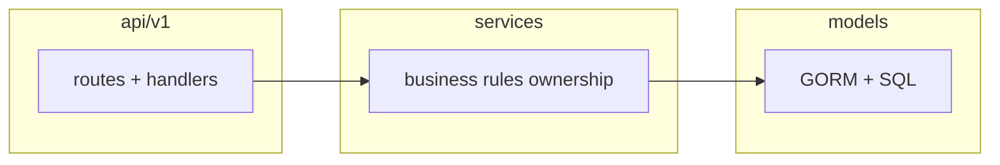

# Kế hoạch CRUD backend be-mycourse theo 4 tài liệu `docs-will-be-delete`

## Chuỗi todo con `pre-rule-*` (rule-before-plan-code — trước Phase 01)

Thay vì **một** todo gộp toàn bộ rule, frontmatter có chuỗi `pre-rule-*` tách nhỏ theo từng nghĩa vụ trong [.cursor/rules/rule-before-plan-code.mdc](.cursor/rules/rule-before-plan-code.mdc) (§0–§8, §11, nhắc §9/§10/§12 sau approve), kèm mục riêng đào sâu reusable-assets. Làm **lần lượt** từ `pre-rule-01` đến hết nhóm `pre-rule-*` rồi mới tới `phase-01-start`. **Không** nhét nội dung rule vào todo `phase-*-core`.

Dưới đây là checklist cùng nội dung (để đối chiếu nhanh):

1. **§0** — Chế độ discovery/planning; **không code** ứng dụng cho đến khi hoàn tất §7–§8 và user approve.
2. **§3.0** — Đọc **tất cả** file ở root repo (bước này **không** dùng GitNexus).
3. **§0 + §3.1** — Chạy **`gitnexus analyze --force`** (hoặc MCP tương đương) **trước mọi** discovery/analysis tiếp theo; các bước explore sau **bắt buộc** dùng GitNexus MCP hoặc CLI.
4. **§3.3** — Nếu có thư mục **`.context/`**: thực hiện đủ Step 1→4 (ingestion, reconstruction, validation, integration) **trước** discovery khác.
5. **§5 + Subagent execution** — Chạy discovery phase 1→5 với **8 subagent lanes**: S1 folder-structure, S2 API map, S3 data-flow, S4 modules/dependencies, S5 DB schema+migration, S6 RBAC/permissions impact, S7 reusable-assets deep scan, S8 testing/validation surface; mỗi lane phải có output artifact.
6. **§3.1** — Explore cây thư mục đệ quy theo quy tắc rule (folder/file/mixed).
7. **§3.2** — Agent cha tổng hợp kết quả **8 lanes**; validate chéo, **resolve conflict**, chốt bản đồ ảnh hưởng hợp nhất.
8. **§4** — Kiểm tra **`docs/`**; nếu chưa có thì tạo snapshot đủ file theo **§4.2** (architecture, folder-structure, data-flow, api-overview, modules, patterns, dependencies, reusable-assets, router/api nếu có, …) và cập nhật theo output của 8 lanes.
9. **§6** — Task analysis **6.1–6.4**; **§6.3** cross-check `docs/`; **§6.3.1** `reusable-assets.md`; **§6.3.2** reuse, không duplicate; map từng CRUD/query vào asset tái sử dụng hoặc asset mới cần tạo.
10. **§7** — Tạo **`IMPLEMENTATION_PLAN_EXECUTION.md`** trong repo với đủ: Discovery Summary, Folder Structure, Module Responsibilities, Data Flow, Related Features, Task Analysis, **Reusability Strategy**, **Action Plan** (paths, ước LoC, mô tả logic).
11. **§7 Mandatory Response** — Gửi user **đúng** câu tiếng Anh rule: *"The implementation plan has been written to IMPLEMENTATION_PLAN_EXECUTION.md. Please review and provide explicit approval (e.g., 'Approved', 'Proceed') before I begin coding."*
12. **§8 HARD STOP** — **Dừng**; chỉ bắt đầu **Phase 01** khi user trả lời explicit **Approved** / **Proceed**.

**Sau checklist:** mỗi phase code (01–12) thêm **AGENTS.md**: `gitnexus_impact` / context cho symbol sửa nhiều; không đụng engine RBAC/middleware (constraint user).

---

## 12 phase code (độ khó tăng dần — CHỈ sau chuỗi `pre-rule-*`)

Frontmatter có **190** `todo` tổng: **23** todo `pre-rule-*` (bao gồm mục đào sâu reusable-assets và mục đồng bộ với `IMPLEMENTATION_PLAN_EXECUTION.md`); **134** todo nhánh giữa (`phase-01-start|core|end` + `phase-sub-01-task-*` ×4 + `phase-sub-02-task-*` ×10 + `phase-sub-03-task-*` ×10 + `phase-sub-04-task-*` ×20 + `phase-sub-05-task-*` ×15 + `phase-sub-06-task-*` ×16 + `phase-sub-07-task-*` ×10 + `phase-sub-08-task-*` ×12 + `phase-sub-09-task-*` ×12 + `phase-sub-10-task-*` ×6 + `phase-sub-11-task-*` ×12 + `phase-sub-12-task-*` ×4 — sub03 giới hạn upload **2GB mỗi file**; sub04 **chuẩn hóa upload pipeline openedu-core**; sub05 persistence media; sub06 reuse/replace/orphan-safe update; **sub07** dọn file/object ảnh mồ côi khi DELETE bản ghi còn URL/thuộc tính ảnh; sub08 metadata/kind server-side typed; **sub09** bổ sung `video_id` + `thumbnail_url` + `embeded_html` trên `UploadFileResponse` sau Bunny upload; **sub10** khởi tạo B2/Gcore/Bunny storage clients từ `setting.MediaSetting` thay vì `os.Getenv` trong `NewCloudClientsFromEnv`; **sub11** WebP ảnh qua CGO+bimg+gate đồng thời, chặn file thực thi lúc create, Bunny chờ 360p trước DB+response; **sub12** response media không trả `origin_url` URL gốc — giữ field DTO, chỉ bỏ giá trị trả client); rồi **33** todo `phase-02-start` … `phase-12-end` (mỗi phase `NN` từ 02→12: **`phase-NN-start`** → **`phase-NN-core`** → **`phase-NN-end`**, không gộp chung một `content`).

### Ý nghĩa từng nhóm todo phase

| Todo id | Vai trò |
|---------|---------|
| `phase-NN-start` | Đầu phase: đọc lại `.context/` + `docs/`; Git diff/log; cập nhật `docs/` — **không** implement feature ở đây. |
| `phase-NN-core` | Giữa phase: DDL → models/dto/services/routes → query đúng domain bảng; tuân folder; reuse/tạo util đúng chỗ; GitNexus impact khi cần. |
| `phase-NN-end` | Cuối phase: review code; cập nhật `docs/` + `.context/`; chỉ sau đó mở `phase-(NN+1)-start` (phase 12 xong là kết thúc chuỗi code). |

Thứ tự kỹ thuật trong **`phase-NN-core`**: **DDL → models/dto/services/routes → query**; độ khó domain tăng dần từ phase 01 → 12 (xem bảng domain dưới).

| Phase (3 todo: start/core/end) | Domain | Độ khó (tóm tắt cho phần *core*) |
|-------|--------|------------------|
| 01 | Taxonomy | CRUD/query đơn giản nhất |
| 02 | Course shell | CRUD 1 bảng chính, list/filter |
| 03 | Course edits / versioning | State machine + FK published |
| 04 | Metadata + junctions | Nhiều bảng, join 1-hop |
| 05 | Sections / lessons | Cây + reorder |
| 06 | Text JSONB + video + subtitle | JSONB, media |
| 07 | Quiz authoring | Nested sâu |
| 08 | Course series | Series + ordered M:N |
| 09 | Coupons + scope | Điều kiện OR phức tạp |
| 10 | Orders + items | CHECK, aggregates |
| 11 | Enrollments | UNIQUE + FK edit |
| 12 | Progress + attempts + reviews | JSONB progress, sync_uid, cây reply, GIN |

## Bối cảnh hiện tại

- DB chỉ có RBAC + `users` + bảng system trong [migrations/000001_schema.up.sql](migrations/000001_schema.up.sql); **chưa** có bảng khóa học / commerce / learning (đúng với [docs/modules/course.md](docs/modules/course.md): course API “planned”).
- API JWT đã gắn `permissions` từ DB ([services/auth.go](services/auth.go)); middleware [middleware/rbac.go](middleware/rbac.go) giữ nguyên — **không** đổi cơ chế RBAC, chỉ **thêm** dòng catalog trong [constants/permissions.go](constants/permissions.go) và cặp `role`/`perm_id` trong [constants/roles_permission.go](constants/roles_permission.go) (không thêm role, không đổi tên/giá trị P1–P13).
- Đồng bộ DB: `go run ./cmd/syncpermissions` và `go run ./cmd/syncrolepermissions` ([internal/rbacsync/sync.go](internal/rbacsync/sync.go)) — sau khi đổi constants, cần chạy (hoặc job system đã có) để `role_permissions` khớp catalog.

## Nguồn chân lý theo từng file (bỏ qua `sample_curl_api.md` cho thiết kế API)

| File | Dùng cho |
|------|-----------|
| [docs-will-be-delete/sample_sql_full.md](docs-will-be-delete/sample_sql_full.md) | ENUM, bảng, FK, index, ràng buộc nghiệp vụ (chuẩn hóa DDL). |
| [docs-will-be-delete/sample_chuc_nang.md](docs-will-be-delete/sample_chuc_nang.md) | Ai làm gì (instructor / learner / admin / sysadmin) → quyền + kiểm tra sở hữu trong service. |
| [docs-will-be-delete/sample_modules.md](docs-will-be-delete/sample_modules.md) | Nhóm chức năng (taxonomy, course_management, learning_workspace, commerce, interactions) → cấu trúc package/route. |
| [docs-will-be-delete/sample_curl_api.md](docs-will-be-delete/sample_curl_api.md) | **Không** dùng làm contract API (port, path, body khác stack hiện tại). |

## Điều chỉnh bắt buộc so với DDL mẫu

- **FK người dùng**: Toàn bộ `REFERENCES users(id)` trong mẫu phải trỏ tới `users(id)` kiểu **BIGSERIAL** ([models/user.go](models/user.go)), không dùng UUID user.
- **Vai trò nghiệp vụ**: Mẫu có `user_role` enum trên `users` — **không** thêm vào bảng `users`; vẫn dùng `user_roles` + RBAC hiện có.
- **LZ4 trên JSONB** (`ALTER ... SET COMPRESSION lz4`): tùy phiên bản Postgres; trong migration nên **bỏ hoặc tách** bước này (comment + kiểm tra version) để tránh migrate fail trên môi trường cũ.
- **Độ dài `permission_name`**: Cột hiện `VARCHAR(50)` ([migrations/000001_schema.up.sql](migrations/000001_schema.up.sql)). Khi đặt tên quyền mới, giữ chuỗi ngắn (ví dụ `category:read` thay vì chuỗi quá dài); nếu cần, **cùng migration domain** nên `ALTER TABLE permissions ALTER COLUMN permission_name TYPE VARCHAR(128)` để dự phòng (chỉ DDL, không đổi dữ liệu P1–P13).

## Migration

- Thêm cặp file mới theo golang-migrate: ví dụ `000002_elearning_domain.up.sql` / `000002_elearning_domain.down.sql` (embed [migrations/embed.go](migrations/embed.go) đã `*.sql` — chỉ cần thêm file).
- Nội dung `up`: `CREATE TYPE` (các enum trong mẫu), `CREATE TABLE` theo thứ tự phụ thuộc (taxonomy → `courses` / `course_series` → `course_edits` → `sections` / `lessons` → bảng con nội dung / quiz / coupon / orders / enrollments / progress / reviews…), index như mẫu, chỉnh FK `users`.
- `down`: `DROP TABLE` theo thứ tự ngược + `DROP TYPE`.
- **Seed quyền trong SQL (tùy chọn nhưng nên có)**: `INSERT INTO permissions` cho các `P14+` mới để môi trường chỉ chạy migrate vẫn có hàng permission; **map role–permission** nên coi **constants + `syncrolepermissions`** là nguồn chính (tránh duplicate logic SQL khó bảo trì). Trong tài liệu triển khai ghi rõ: sau migrate chạy sync hai lệnh trên.

## Thiết kế REST API (tự định nghĩa, thống nhất với codebase)

- Base: `/api/v1` (đã có trong [api/router.go](api/router.go)); JSON envelope [pkg/response](pkg/response/response.go).
- Quy ước gợi ý (REST, snake_case JSON theo style hiện có như `display_name`):
  - Taxonomy: `GET/POST /taxonomy/levels`, `GET/PATCH/DELETE /taxonomy/levels/:id` (tương tự `/taxonomy/categories`, `/taxonomy/tags`).
  - Courses: `POST /courses`, `GET /courses/:id`, `PATCH /courses/:id`, `DELETE /courses/:id`, kèm sub-resource nested: `/courses/:courseId/edits`, `/courses/:courseId/edits/:editId/sections`, … (hoặc flat `/sections?edit_id=` nếu muốn ít nesting hơn — chọn một pattern và dùng xuyên suốt).
  - Series, coupons, orders, enrollments, progress, reviews: nhóm prefix rõ (`/series`, `/coupons`, `/orders`, `/enrollments`, `/me/progress`, `/reviews`, …).
- Một số **read công khai** (catalog) có thể đăng ký dưới `RegisterNotAuthenRoutes` + rate limit; phần còn lại `RegisterAuthenRoutes` + `middleware.RequirePermission(...)`.
- **Không** triển khai webhook thanh toán / tích hợp cổng thanh toán trong phạm vi “CRUD bảng” trừ khi bạn mở rộng scope sau; CRUD `orders` / `order_items` + chuyển trạng thái là đủ để khớp schema & order lifecycle mô tả ở mức dữ liệu.

## Lớp code (theo pattern hiện có)

- `models/*.go`: GORM model + `TableName()`; enum Postgres map kiểu string hoặc custom `Valuer/Scanner`.
- `dto/*.go`: request/response bind JSON.
- `services/*.go`: nghiệp vụ, transaction, **kiểm tra sở hữu** (instructor là `courses.instructor_id` hoặc `course_instructors`, learner chỉ `user_id` của chính họ trên enrollment/order…).
- `api/v1/*.go` + cập nhật [api/v1/routes.go](api/v1/routes.go): đăng ký route và middleware quyền.

## Catalog quyền mới (P14+) — nguyên tắc

- **Không** sửa P1–P13 và không thêm role.
- Giữ pattern `resource:action` như catalog hiện tại.
- Tận dụng quyền đã có khi đủ nghĩa: ví dụ nội dung section/lesson/quiz **gắn `course_edits`** có thể dùng `course:update` + kiểm tra instructor/course_instructors thay vì tạo hàng chục quyền trùng ý nghĩa.
- **Bắt buộc bổ sung** nơi spec tách vai trò rõ hoặc hiện chỉ có read:
  - Co-instructor: hiện chỉ [P9 `course_instructor:read`](constants/permissions.go) — thêm quyền ghi tối thiểu (ví dụ `course_instructor:create`, `course_instructor:delete`) hoặc một `course_instructor:manage` nếu muốn gom (ưu tiên rõ ràng cho audit: tách create/delete).
  - Taxonomy (admin): CRUD cho `course_levels`, `categories`, `tags` (ví dụ `course_level:*`, `category:*`, `tag:*`).
  - `course_series`, `coupons`, `orders`, `enrollments`, tiến trình học (`learning_progress:read|update` hoặc tương đương), đánh giá (`review:*`, `instructor_rating:*`), hàng chờ duyệt phiên bản (`course_approval:read|update` cho admin), chứng chỉ cấu hình (`certificate:read|update` nếu không gom hết vào `course:update`).
- Gán role (chỉ **mở rộng** struct tags trong [constants/roles_permission.go](constants/roles_permission.go)):
  - **sysadmin**: mọi `perm_id` mới (đồng bộ full catalog như hiện tại với P1–P13).
  - **admin**: taxonomy + approval + đọc/sửa đơn hệ thống + quyền user/course đã có.
  - **instructor**: coupon, chỉnh sửa khóa học/series thuộc quyền, co-instructor, đọc analytics liên quan lớp.
  - **learner**: đặt hàng (create/read own), enrollment, cập nhật progress, tạo review/rating phù hợp policy.

(Bảng chi tiết `P14…` sẽ được chốt khi implement để số lượng khớp số field `perm_id` và không vượt quá giới hạn cột `permission_name`.)

## Quy trình chất lượng theo dự án

- Trước/sau chỉnh sửa symbol quan trọng: làm theo [AGENTS.md](AGENTS.md) (GitNexus impact/context). Lưu ý rule workspace: trước discovery có yêu cầu `gitnexus analyze` — thực hiện khi chuyển sang chế độ implement.
- Sau đổi constants RBAC: chạy `syncpermissions` + `syncrolepermissions`; user cần **đăng nhập lại** để JWT có permission mới.

## Phạm vi hoàn chỉnh vs thứ tự làm việc

“Hết toàn bộ chức năng” = đủ bảng + CRUD theo `sample_sql_full.md` + vai trò `sample_chuc_nang.md` / module `sample_modules.md`. **Thứ tự triển khai:** frontmatter `todos` có **190** mục — **23** `pre-rule-*`; `phase-01-start|core|end` + các chuỗi `phase-sub-01` … `phase-sub-12` (mỗi task sub có **Đầu/Giữa/Cuối** như sub02: đọc `docs/` + `.context/` + docs + GitNexus → làm core task → sync docs + `docs/*` + `.context/` theo `be-mycourse/.cursor/skills/session-context-handoff/SKILL.md` + GitNexus; **sub07** = orphan **ảnh**/object sau DELETE; **sub09** = Bunny response `video_id` / `thumbnail_url` / `embeded_html`; **sub10** = cloud SDK init đọc `setting.MediaSetting` không đọc lại env trong `NewCloudClientsFromEnv`; **sub11** = WebP CGO+bimg+concurrency gate, deny executable trên create file, Bunny chờ 360p trước persist+success; **sub12** = không trả URL gốc trong `origin_url` response, giữ struct `dto/media_file.go`); rồi **33** todo `phase-02-start` … `phase-12-end` cộng **3** todo `phase-01-start|core|end` (= **36** mục phase code tổng); bảng phía trên là domain của từng phase (*core*). Không dùng lại danh sách 1–7 cũ.

Mỗi phase: slice **chạy được** nằm trong **`phase-NN-core`** (migrate + API + query tối thiểu domain); **`phase-NN-end`** bắt buộc khép review + cập nhật `docs/` + `.context/` trước phase kế. Trong **core**: GitNexus impact trước khi sửa symbol quan trọng (AGENTS.md); sau đổi quyền thì syncpermissions/syncrolepermissions và ghi chú re-login JWT.
