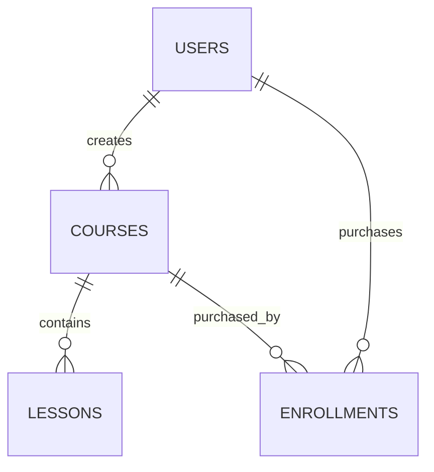

# Database Schema

## Tables

### `users`

- `id` (uuid, pk)
- `email` (varchar, unique, not null)
- `password_hash` (text, not null)
- `full_name` (varchar)
- `role` (varchar: admin|instructor|student)
- `created_at`, `updated_at`

### `courses`

- `id` (uuid, pk)
- `instructor_id` (uuid, fk -> users.id)
- `title` (varchar, not null)
- `description` (text)
- `price` (numeric)
- `thumbnail_url` (text)
- `created_at`, `updated_at`

### `lessons`

- `id` (uuid, pk)
- `course_id` (uuid, fk -> courses.id)
- `title` (varchar, not null)
- `video_url` (text)
- `position` (int)
- `is_preview` (bool)
- `created_at`, `updated_at`

### `enrollments`

- `id` (uuid, pk)
- `student_id` (uuid, fk -> users.id)
- `course_id` (uuid, fk -> courses.id)
- `status` (varchar: active|cancelled|refunded)
- `enrolled_at` (timestamp)

## Relationships

- One `User (Instructor)` has many `Course`.
- One `Course` has many `Lesson`.
- Many `User (Student)` enroll in many `Course` via `Enrollment`.

## ER Diagram

