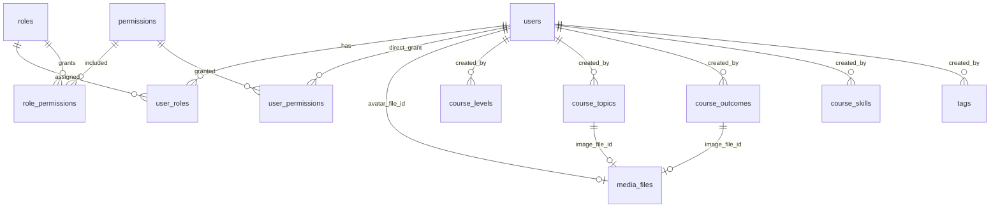

# Database Schema

PostgreSQL schema for **be-mycourse**, managed with **golang-migrate** (`migrations/*.sql`, embedded via `migrations/embed.go`).

Run pending migrations:

```bash
MIGRATE=1 go run .
```

Rollback by specific migration file (down):

```bash
MIGRATE=2 MIGRATE_VERSION_FILE=000016_course_management.down.sql go run .
```

See `migrations/README.md` for migration conventions (semicolon splitting, `COMMENT` rules, rollback).

## Code ↔ table names

All PostgreSQL relation names are defined once in **`internal/shared/constants/dbschema_name.go`**. GORM `TableName()` methods and raw SQL must use those constants — do not hardcode table strings in handlers or repositories.

| Constant | Table |
|----------|-------|
| `TableAppUsers` | `users` |
| `TableRBACPermissions` | `permissions` |
| `TableRBACRoles` | `roles` |
| `TableRBACRolePermissions` | `role_permissions` |
| `TableRBACUserRoles` | `user_roles` |
| `TableRBACUserPermissions` | `user_permissions` |
| `TableMediaFiles` | `media_files` |
| `TableMediaPendingCloudCleanup` | `media_pending_cloud_cleanup` |
| `TableTaxonomyCourseLevels` | `course_levels` |
| `TableTaxonomyCourseTopics` | `course_topics` |
| `TableTaxonomyCourseOutcomes` | `course_outcomes` |
| `TableTaxonomyCourseSkills` | `course_skills` |
| `TableTaxonomyTags` | `tags` |
| `TableSystemAppConfig` | `system_app_config` |
| `TableSystemPrivilegedUsers` | `system_privileged_users` |

GORM row models live under each bounded context’s `infra` package (for example `internal/auth/infra/user_model.go`, `internal/media/infra/repos.go`).

## Table of Contents

- [Entity relationship overview](#entity-relationship-overview)
- [PostgreSQL types](#postgresql-types)
- [RBAC tables](#rbac-tables)
  - [`permissions`](#permissions)
  - [`roles`](#roles)
  - [`role_permissions`](#role_permissions)
  - [`user_roles`](#user_roles)
  - [`user_permissions`](#user_permissions)
  - [Permission catalog (P1–P40)](#permission-catalog-p1p40)
  - [Default role ↔ permission matrix](#default-role--permission-matrix)
- [Application users](#application-users)
  - [`users`](#users)
- [Taxonomy](#taxonomy)
  - [`course_levels`](#course_levels)
  - [`course_topics`](#course_topics)
  - [`course_outcomes`](#course_outcomes)
  - [`course_skills`](#course_skills)
  - [`tags`](#tags)
- [Media](#media)
  - [`media_files`](#media_files)
  - [`media_pending_cloud_cleanup`](#media_pending_cloud_cleanup)
- [System tables](#system-tables)
- [Effective permissions](#effective-permissions)
- [RBAC sync commands](#rbac-sync-commands)
- [Migration history](#migration-history)
- [Drop all tables (manual reset)](#drop-all-tables-manual-reset)

---

## Entity relationship overview



- **RBAC junction tables** use `users.id` (`BIGINT`), not `user_code`.
- **JWT / middleware** use `permissions.permission_name` strings (`resource:action`).
- **`media_files`** is referenced by `users.avatar_file_id`, `course_topics.image_file_id`, and `course_outcomes.image_file_id` (`ON DELETE SET NULL`).

---

## PostgreSQL types

### `taxonomy_status` (enum)

Created in migration `000002_taxonomy_domain`:

| Value | Meaning |
|-------|---------|
| `ACTIVE` | Visible / usable in admin APIs |
| `INACTIVE` | Hidden or disabled |

Used by `course_levels.status`, `course_topics.status`, `course_outcomes.status`, `course_skills.status`, `tags.status`. Default: `ACTIVE`.

### Audit timestamps (`created_at`, `updated_at`, `deleted_at`)

Since migration **`000011_audit_timestamps_bigint`**, all audit columns store **Unix epoch seconds** as **`BIGINT`**. Defaults use `EXTRACT(EPOCH FROM NOW())::BIGINT`. Go domain/infra/DTO layers use `int64` (nullable `*int64` for `deleted_at`). JSON APIs emit **numbers**, not RFC3339 strings.

Application code sets audit fields via **`internal/shared/timex.NowUnix()`** and **`internal/shared/gormx`** (`TouchCreatedUpdated`, `TouchUpdated`, `SoftDeleteWithAudit`) — not GORM `autoCreateTime` / `autoUpdateTime`.

**Migration note:** Postgres cannot cast an existing `TIMESTAMPTZ DEFAULT NOW()` to `BIGINT` in one step. Migration `000011` drops defaults first, alters types with `USING EXTRACT(EPOCH FROM …)::BIGINT`, then sets the new bigint defaults.

Other time columns (`confirmation_sent_at`, `next_run_at`, JWT `exp`/`iat`) remain **`TIMESTAMPTZ`** or token-native types.

---

## RBAC tables

### `permissions`

Flat permission catalog. Primary key is the stable catalog id (`permission_id`, e.g. `P1`), not a surrogate bigint.

| Column | Type | Constraints | Description |
|--------|------|-------------|-------------|
| `permission_id` | `VARCHAR(10)` | PK | Stable id (`P{number}`); matches `perm_id` tags on `constants.AllPermissions` |
| `permission_name` | `VARCHAR(50)` | UNIQUE NOT NULL | Runtime string in JWT `permissions` claim and `middleware.RequirePermission` (`resource:action`) |
| `description` | `VARCHAR(512)` | NOT NULL DEFAULT `''` | |
| `created_at` | `BIGINT` | NOT NULL DEFAULT `EXTRACT(EPOCH FROM NOW())::BIGINT` | Unix epoch seconds |
| `updated_at` | `BIGINT` | NOT NULL DEFAULT `EXTRACT(EPOCH FROM NOW())::BIGINT` | Unix epoch seconds |

**GORM model:** `internal/rbac/infra/repos.go` (`permissionRow`), `internal/system/infra/repos.go` (`permissionSyncRow` for sync).

---

### `roles`

Named roles. Default names: `sysadmin`, `admin`, `instructor`, `learner` (seeded in `000001_schema`).

| Column | Type | Constraints | Description |
|--------|------|-------------|-------------|
| `id` | `BIGSERIAL` | PK | |
| `name` | `VARCHAR(64)` | UNIQUE NOT NULL | |
| `description` | `VARCHAR(512)` | NOT NULL DEFAULT `''` | |
| `created_at` | `BIGINT` | NOT NULL DEFAULT `EXTRACT(EPOCH FROM NOW())::BIGINT` | Unix epoch seconds |
| `updated_at` | `BIGINT` | NOT NULL DEFAULT `EXTRACT(EPOCH FROM NOW())::BIGINT` | Unix epoch seconds |

**GORM model:** `internal/rbac/infra/repos.go` (`roleRow`).

---

### `role_permissions`

Many-to-many: roles ↔ permissions.

| Column | Type | Constraints |
|--------|------|-------------|
| `role_id` | `BIGINT` | FK → `roles(id)` ON DELETE CASCADE |
| `permission_id` | `VARCHAR(10)` | FK → `permissions(permission_id)` ON DELETE CASCADE, ON UPDATE CASCADE |

**Primary key:** `(role_id, permission_id)`.

---

### `user_roles`

Many-to-many: users ↔ roles.

| Column | Type | Constraints |
|--------|------|-------------|
| `user_id` | `BIGINT` | FK → `users(id)` ON DELETE CASCADE |
| `role_id` | `BIGINT` | FK → `roles(id)` ON DELETE CASCADE |

**Primary key:** `(user_id, role_id)`.  
**Index:** `idx_user_roles_user` on `user_id`.

After email confirmation, the auth flow assigns the **`learner`** role (requires `000001` seed).

---

### `user_permissions`

Direct permission grants (unioned with role permissions at login).

| Column | Type | Constraints |
|--------|------|-------------|
| `user_id` | `BIGINT` | FK → `users(id)` ON DELETE CASCADE |
| `permission_id` | `VARCHAR(10)` | FK → `permissions(permission_id)` ON DELETE CASCADE, ON UPDATE CASCADE |

**Primary key:** `(user_id, permission_id)`.  
**Index:** `idx_user_permissions_user` on `user_id`.

---

### Permission catalog (P1–P40)

Canonical definitions: **`internal/shared/constants/permissions.go`** (`constants.AllPermissions`).  
Reflection helper for sync: **`internal/system/application/catalog.go`** → `AllPermissionEntries()`.

| ID | `permission_name` | Domain |
|----|-----------------|--------|
| P1 | `profile:read` | Profile |
| P2 | `profile:update` | Profile |
| P3 | `profile:delete` | Profile |
| P4 | `profile:create` | Profile |
| P5 | `course:read` | Course |
| P6 | `course:update` | Course |
| P7 | `course:delete` | Course |
| P8 | `course:create` | Course |
| P9 | `course_instructor:read` | Course instructor |
| P10 | `user:read` | User admin |
| P11 | `user:update` | User admin |
| P12 | `user:delete` | User admin |
| P13 | `user:create` | User admin |
| P14 | `course_level:read` | Taxonomy |
| P15 | `course_level:create` | Taxonomy |
| P16 | `course_level:update` | Taxonomy |
| P17 | `course_level:delete` | Taxonomy |
| P18 | `topic:read` | Taxonomy (course topics) |
| P19 | `topic:create` | Taxonomy |
| P20 | `topic:update` | Taxonomy |
| P21 | `topic:delete` | Taxonomy |
| P22 | `tag:read` | Taxonomy |
| P23 | `tag:create` | Taxonomy |
| P24 | `tag:update` | Taxonomy |
| P25 | `tag:delete` | Taxonomy |
| P26 | `media_file:read` | Media |
| P27 | `media_file:create` | Media |
| P28 | `media_file:update` | Media |
| P29 | `media_file:delete` | Media |
| P30 | `course_outcome:read` | Taxonomy |
| P31 | `course_outcome:create` | Taxonomy |
| P32 | `course_outcome:update` | Taxonomy |
| P33 | `course_outcome:delete` | Taxonomy |
| P34 | `course_skill:read` | Taxonomy |
| P35 | `course_skill:create` | Taxonomy |
| P36 | `course_skill:update` | Taxonomy |
| P37 | `course_skill:delete` | Taxonomy |
| P38 | `sysadmin:modify` | Role modify |
| P39 | `admin:modify` | Role modify |
| P40 | `instructor:modify` | Role modify |
| P41 | `instructor_roster:read` | Instructor roster |
| P42 | `instructor_roster:create` | Instructor roster |
| P43 | `instructor_roster:delete` | Instructor roster |
| P44 | `instructor_application:read` | Instructor application |
| P45 | `instructor_application:create` | Instructor application |
| P46 | `instructor_application:update` | Instructor application |
| P47 | `instructor_application:delete` | Instructor application |
| P48 | `instructor_application:approve` | Instructor application |
| P49 | `instructor_application:reject` | Instructor application |
| P50 | `instructor_profile:read` | Instructor profile |
| P51 | `instructor_profile:create` | Instructor profile |
| P52 | `instructor_profile:update` | Instructor profile |
| P53 | `instructor_profile:delete` | Instructor profile |
| P54 | `instructor_expertise:read` | Instructor expertise |
| P55 | `instructor_expertise:create` | Instructor expertise |
| P56 | `instructor_expertise:update` | Instructor expertise |
| P57 | `instructor_expertise:delete` | Instructor expertise |
| P58 | `instructor_ticket:close` | Instructor ticket |

- **P1–P13** are seeded in `000001_schema.up.sql`.
- **P14–P25** are inserted in `000002_taxonomy_domain.up.sql` (`ON CONFLICT DO UPDATE` on `permission_name`).
- **P26–P29** exist only in code until `go run ./cmd/syncpermissions` (or first deploy sync) inserts them.
- **P18–P21** names are updated to `topic:*` in `000009_taxonomy_topics_outcomes_skills`.
- **P30–P37** are inserted in `000009` and granted to sysadmin/admin (full CRUD) and instructor/learner (read only).
- **P38–P40** are inserted in `000010_role_modify_permissions` and granted by role tier: sysadmin → P38–P40, admin → P39–P40, instructor → P40 only.
- **P41–P58** are inserted in **`000013_instructor_management`** (instructor roster, applications, profiles, expertise, ticket close). Migration also seeds role grants; keep **`roles_permission.go`** in sync and run **`go run ./cmd/syncpermissions`** + **`go run ./cmd/syncrolepermissions`** after code changes.

---

### Default role ↔ permission matrix

Source of truth for role grants: **`internal/system/application/roles_permission.go`** (`RolePermissions` struct tags).  
Rebuild DB matrix: `go run ./cmd/syncrolepermissions`.

| Role | Permission IDs (summary) |
|------|--------------------------|
| **sysadmin** | P1–P58 (full catalog) |
| **admin** | P1–P8, P10–P58 except **P9** `course_instructor:read` and **P38** `sysadmin:modify` |
| **instructor** | P1, P5–P7, P9–P10, P14, P18, P22, P26–P29, P30, P34, P40, **P45, P47, P49, P55–P58** (applications submit/delete/reject, expertise mutate, ticket close) |
| **learner** | P1, P5, P10, P14, P18, P22, P26, P30, P34, **P45** (submit application / create ticket) |

`000001_schema` seeds only P1–P13 for the four roles. After adding taxonomy/media permissions, run **`syncrolepermissions`** so `role_permissions` matches `roles_permission.go`.

---

## Application users

### `users`

Application accounts. Passwords are bcrypt-hashed.

| Column | Type | Constraints | Description |
|--------|------|-------------|-------------|
| `id` | `BIGSERIAL` | PK | Internal joins (RBAC, taxonomy `created_by`) |
| `user_code` | `UUID` | UNIQUE NOT NULL | External id in JWT; app generates **UUIDv7** on register (`uuid.NewV7()`); DB default `gen_random_uuid()` is fallback only |
| `email` | `VARCHAR(255)` | UNIQUE NOT NULL | Login email |
| `hash_password` | `VARCHAR(255)` | NOT NULL | bcrypt hash |
| `display_name` | `VARCHAR(255)` | NOT NULL DEFAULT `''` | |
| `avatar_file_id` | `UUID` | nullable, FK → `media_files(id)` ON DELETE SET NULL | Profile image; API exposes nested `avatar` object, not a raw URL column |
| `is_disable` | `BOOLEAN` | NOT NULL DEFAULT `FALSE` | Permanent admin disable (separate from time-limited ban) |
| `banned_until` | `BIGINT` | nullable | Unix seconds when a time-limited ban **lifts**; `NULL` = not banned (migration **`000012`**) |
| `email_confirmed` | `BOOLEAN` | NOT NULL DEFAULT `FALSE` | Email verified |
| `confirmation_token` | `VARCHAR(128)` | nullable | One-time confirmation token |
| `confirmation_sent_at` | `TIMESTAMPTZ` | nullable | Last confirmation email send time |
| `registration_email_send_total` | `INTEGER` | NOT NULL DEFAULT `0` | Successful confirmation emails while pending; **not** in public JSON; reset to `0` on confirm; cap **15** in app logic |
| `phone` | `VARCHAR(32)` | NOT NULL DEFAULT `''` | Contact phone (roster list); added in **`000013`** |
| `refresh_token_session` | `JSONB` | NOT NULL DEFAULT `'{}'` | Device sessions map (see below) |
| `created_at` | `BIGINT` | NOT NULL DEFAULT `EXTRACT(EPOCH FROM NOW())::BIGINT` | Unix epoch seconds |
| `updated_at` | `BIGINT` | NOT NULL DEFAULT `EXTRACT(EPOCH FROM NOW())::BIGINT` | Unix epoch seconds |
| `deleted_at` | `BIGINT` | nullable | Soft delete (manual UPDATE, Unix epoch seconds) |

**Indexes:** `idx_users_email`, `idx_users_user_code`, `idx_users_deleted_at` (partial, `deleted_at IS NULL`), `idx_users_confirm_token` (partial, token not null), `idx_users_avatar_file_id` (migration `000006`).

**Removed columns (do not document / expect in DB):** `avatar_url` (dropped in `000006`).

**GORM model:** `internal/auth/infra/user_model.go` (`userRow`).

#### `refresh_token_session` JSONB shape

Each key is a **128-character hex session string**; each value:

```json
{
  "<session_string_128_hex>": {
    "refresh_token_uuid": "uuid-v4",
    "remember_me": false,
    "refresh_token_expired": "2026-05-03T12:00:00Z"
  }
}
```

| Rule | Implementation |
|------|----------------|
| Max **5** concurrent sessions per user | `internal/auth/infra/session_limits.go` → `MaxActiveSessions` |
| Overflow eviction | Delete entry with earliest `refresh_token_expired` inside a transaction |
| Add session (may increase count) | `GormRefreshSessionRepository.AddSession` — transactional read/modify/write |
| Rotate same session in place | `GormRefreshSessionRepository.SaveSession` — `jsonb_set` update |

Domain types: `internal/auth/domain/user.go` (`RefreshSessionEntry`, `RefreshTokenSessionMap`).

---

## Taxonomy

Created in **`000002_taxonomy_domain`**. Media FKs added in **`000006_taxonomy_user_media_refs`**. Soft delete added in **`000012_soft_delete_taxonomy_users_ban`**.

**GORM models:** `internal/taxonomy/infra/repos.go` (`courseTopicRow`, `courseOutcomeRow`, `courseSkillRow`, `tagRow`, `courseLevelRow`).

**Soft delete:** default list/get exclude rows where `deleted_at IS NOT NULL`. `DELETE /taxonomy/{resource}/:id` soft-deletes; `DELETE .../:id/hard` permanently removes the row. Slug columns use partial unique indexes (`uix_*_slug_active`) so slugs can be reused after soft delete.

### `course_levels`

| Column | Type | Constraints | Description |
|--------|------|-------------|-------------|
| `id` | `BIGSERIAL` | PK | |
| `name` | `VARCHAR(255)` | NOT NULL | |
| `slug` | `VARCHAR(255)` | NOT NULL | URL-safe identifier; unique among active rows (`uix_course_levels_slug_active`) |
| `status` | `taxonomy_status` | NOT NULL DEFAULT `ACTIVE` | |
| `created_by` | `BIGINT` | nullable, FK → `users(id)` ON DELETE SET NULL | |
| `created_at` | `BIGINT` | NOT NULL DEFAULT `EXTRACT(EPOCH FROM NOW())::BIGINT` | Unix epoch seconds |
| `updated_at` | `BIGINT` | NOT NULL DEFAULT `EXTRACT(EPOCH FROM NOW())::BIGINT` | Unix epoch seconds |
| `deleted_at` | `BIGINT` | nullable | Soft delete (Unix epoch seconds) |

**Indexes:** `idx_course_levels_created_by`, `idx_course_levels_deleted_at` (partial, `deleted_at IS NULL`), `uix_course_levels_slug_active` (partial unique on `slug` where `deleted_at IS NULL`).

---

### `course_topics`

Renamed from `categories` in migration `000009` (IDs preserved).

| Column | Type | Constraints | Description |
|--------|------|-------------|-------------|
| `id` | `BIGSERIAL` | PK | |
| `name` | `VARCHAR(255)` | NOT NULL | |
| `slug` | `VARCHAR(255)` | NOT NULL | Unique among active rows (`uix_course_topics_slug_active`) |
| `image_file_id` | `UUID` | nullable, FK → `media_files(id)` ON DELETE SET NULL | Topic image |
| `child_topics` | `JSONB` | NOT NULL DEFAULT `'[]'` | Nested tree: `{ id, name, slug, children[] }` |
| `status` | `taxonomy_status` | NOT NULL DEFAULT `ACTIVE` | |
| `created_by` | `BIGINT` | nullable, FK → `users(id)` ON DELETE SET NULL | |
| `created_at` | `BIGINT` | NOT NULL DEFAULT `EXTRACT(EPOCH FROM NOW())::BIGINT` | Unix epoch seconds |
| `updated_at` | `BIGINT` | NOT NULL DEFAULT `EXTRACT(EPOCH FROM NOW())::BIGINT` | Unix epoch seconds |
| `deleted_at` | `BIGINT` | nullable | Soft delete (Unix epoch seconds) |

**Indexes:** `idx_course_topics_created_by`, `idx_course_topics_image_file_id`, `idx_course_topics_deleted_at`, `uix_course_topics_slug_active`.

**Removed columns:** `image_url` (dropped in `000006`).

---

### `course_outcomes`

| Column | Type | Constraints | Description |
|--------|------|-------------|-------------|
| `id` | `BIGSERIAL` | PK | |
| `short_description` | `VARCHAR(100)` | NOT NULL | |
| `description` | `JSONB` | NOT NULL DEFAULT `'[]'` | Array of strings (max 8 × 120 chars enforced in app) |
| `image_file_id` | `UUID` | nullable, FK → `media_files(id)` ON DELETE SET NULL | |
| `status` | `taxonomy_status` | NOT NULL DEFAULT `ACTIVE` | |
| `created_by` | `BIGINT` | nullable, FK → `users(id)` ON DELETE SET NULL | |
| `created_at` | `BIGINT` | NOT NULL DEFAULT `EXTRACT(EPOCH FROM NOW())::BIGINT` | Unix epoch seconds |
| `updated_at` | `BIGINT` | NOT NULL DEFAULT `EXTRACT(EPOCH FROM NOW())::BIGINT` | Unix epoch seconds |
| `deleted_at` | `BIGINT` | nullable | Soft delete (Unix epoch seconds) |

**Indexes:** `idx_course_outcomes_created_by`, `idx_course_outcomes_image_file_id`, `idx_course_outcomes_deleted_at`.

---

### `course_skills`

| Column | Type | Constraints | Description |
|--------|------|-------------|-------------|
| `id` | `BIGSERIAL` | PK | |
| `name` | `VARCHAR(255)` | NOT NULL | |
| `slug` | `VARCHAR(255)` | NOT NULL | Unique among active rows (`uix_course_skills_slug_active`) |
| `children` | `JSONB` | NOT NULL DEFAULT `'[]'` | Skill tree (same node shape as `child_topics`) |
| `status` | `taxonomy_status` | NOT NULL DEFAULT `ACTIVE` | |
| `created_by` | `BIGINT` | nullable, FK → `users(id)` ON DELETE SET NULL | |
| `created_at` | `BIGINT` | NOT NULL DEFAULT `EXTRACT(EPOCH FROM NOW())::BIGINT` | Unix epoch seconds |
| `updated_at` | `BIGINT` | NOT NULL DEFAULT `EXTRACT(EPOCH FROM NOW())::BIGINT` | Unix epoch seconds |
| `deleted_at` | `BIGINT` | nullable | Soft delete (Unix epoch seconds) |

**Indexes:** `idx_course_skills_created_by`, `idx_course_skills_deleted_at`, `uix_course_skills_slug_active`.

---

### `tags`

| Column | Type | Constraints | Description |
|--------|------|-------------|-------------|
| `id` | `BIGSERIAL` | PK | |
| `name` | `VARCHAR(255)` | NOT NULL | |
| `slug` | `VARCHAR(255)` | NOT NULL | Unique among active rows (`uix_tags_slug_active`) |
| `status` | `taxonomy_status` | NOT NULL DEFAULT `ACTIVE` | |
| `created_by` | `BIGINT` | nullable, FK → `users(id)` ON DELETE SET NULL | |
| `created_at` | `BIGINT` | NOT NULL DEFAULT `EXTRACT(EPOCH FROM NOW())::BIGINT` | Unix epoch seconds |
| `updated_at` | `BIGINT` | NOT NULL DEFAULT `EXTRACT(EPOCH FROM NOW())::BIGINT` | Unix epoch seconds |
| `deleted_at` | `BIGINT` | nullable | Soft delete (Unix epoch seconds) |

**Indexes:** `idx_tags_created_by`, `idx_tags_deleted_at`, `uix_tags_slug_active`.

## Media

API contract: **`docs/modules/media.md`**.

### `media_files`

Product media (B2 files, Bunny Stream videos, local signed URLs, etc.).

| Column | Type | Constraints | Description |
|--------|------|-------------|-------------|
| `id` | `UUID` | PK | Logical media row id (client-facing) |
| `object_key` | `VARCHAR(512)` | UNIQUE NOT NULL | B2 object key or Bunny video GUID |
| `kind` | `VARCHAR(16)` | NOT NULL | `FILE` or `VIDEO` (server-derived; see media module) |
| `provider` | `VARCHAR(16)` | NOT NULL | e.g. `B2`, `Bunny`, `Local` |
| `filename` | `VARCHAR(512)` | NOT NULL | Original filename |
| `mime_type` | `VARCHAR(255)` | NOT NULL DEFAULT `''` | |
| `size_bytes` | `BIGINT` | NOT NULL DEFAULT `0` | |
| `url` | `TEXT` | NOT NULL | Public / CDN distribution URL |
| `origin_url` | `TEXT` | NOT NULL | Provider canonical URL; **server-only** for orphan cleanup — **not** exposed on public upload/list JSON |
| `status` | `VARCHAR(16)` | NOT NULL DEFAULT `READY` | e.g. `READY`, `PENDING`, `FAILED`, `DELETED` |
| `b2_bucket_name` | `VARCHAR(255)` | NOT NULL DEFAULT `''` | B2 bucket when applicable |
| `bunny_video_id` | `VARCHAR(255)` | nullable | Bunny GUID |
| `bunny_library_id` | `VARCHAR(255)` | NOT NULL DEFAULT `''` | Bunny library id |
| `video_id` | `VARCHAR(255)` | NOT NULL DEFAULT `''` | Bunny numeric id or guid string (API `video_id`) |
| `thumbnail_url` | `TEXT` | NOT NULL DEFAULT `''` | CDN thumbnail |
| `embeded_html` | `TEXT` | NOT NULL DEFAULT `''` | Escaped iframe HTML (JSON key spelling `embeded_html`) |
| `duration` | `BIGINT` | NOT NULL DEFAULT `0` | Flat duration field (seconds) for listings |
| `video_provider` | `VARCHAR(64)` | NOT NULL DEFAULT `''` | |
| `row_version` | `BIGINT` | NOT NULL DEFAULT `1` | Optimistic concurrency / orphan safety (`000004`) |
| `content_fingerprint` | `VARCHAR(128)` | NOT NULL DEFAULT `''` | Content hash for bundle updates (`000004`) |
| `metadata_json` | `JSONB` | NOT NULL DEFAULT `'{}'` | Server-side provider + typed metadata store; **not** returned raw in API — mapped to typed `metadata` in responses |
| `created_at` | `BIGINT` | NOT NULL DEFAULT `EXTRACT(EPOCH FROM NOW())::BIGINT` | Unix epoch seconds |
| `updated_at` | `BIGINT` | NOT NULL DEFAULT `EXTRACT(EPOCH FROM NOW())::BIGINT` | Unix epoch seconds |
| `deleted_at` | `BIGINT` | nullable | Soft delete (Unix epoch seconds) |

**Indexes:** `idx_media_files_kind`, `idx_media_files_provider`, `idx_media_files_bunny_video_id`, `idx_media_files_created_at`, `idx_media_files_metadata_json_gin` (GIN on `metadata_json`, migration `000008`).

**GORM model:** `internal/media/infra/repos.go` (`mediaFileRow`).  
**Domain entity:** `internal/media/domain/media.go` (`File`, `MediaFile`).

#### `metadata_json` (server-side)

- Default `{}` on insert.
- Holds provider-native keys plus normalized typed keys used by `BuildTypedMetadata` / API DTOs, for example: `duration_seconds`, `width_bytes`, `height_bytes`, `fps`, `mime_type`, `extension`, `bitrate`, `video_codec`, `audio_codec`, `has_audio`, `is_hdr`, `page_count`, `has_password`, `archive_entries`, and Bunny parity keys (`video_id`, `thumbnail_url`, `embeded_html`) — see `internal/media/domain/meta_keys.go` and `internal/media/infra/media_metadata.go`.
- Migration `000008` backfills typed keys from legacy aliases (`width`, `height`, `duration`, `length`, `framerate`, …).

#### Upsert persistence (`UpsertByObjectKey`)

Single write path for upload create and Bunny webhook update (`internal/media/infra/repos.go`):

1. `SELECT` active row by `object_key` (`deleted_at IS NULL`).
2. **Not found** → `INSERT` (`Create`) so table defaults apply.
3. **Found** → `Updates(map[string]any{...})` with **every** editable column enumerated (including zero values). Map-based updates are required because struct-based GORM updates skip zero values and previously broke webhook duration/metadata writes.

---

### `media_pending_cloud_cleanup`

Deferred cloud object deletion queue (`000004_media_orphan_safety`). No FK to `media_files` — rows are enqueued when DB references are cleared or files are deleted.

| Column | Type | Constraints | Description |
|--------|------|-------------|-------------|
| `id` | `BIGSERIAL` | PK | |
| `provider` | `VARCHAR(16)` | NOT NULL | Target cloud (`B2`, `Bunny`, …) |
| `object_key` | `VARCHAR(512)` | NOT NULL DEFAULT `''` | B2 key when applicable |
| `bunny_video_id` | `VARCHAR(255)` | NOT NULL DEFAULT `''` | Bunny GUID when applicable |
| `status` | `VARCHAR(32)` | NOT NULL DEFAULT `pending` | Worker status |
| `attempt_count` | `INT` | NOT NULL DEFAULT `0` | Retry counter |
| `last_error` | `TEXT` | NOT NULL DEFAULT `''` | Last failure message |
| `next_run_at` | `TIMESTAMPTZ` | NOT NULL DEFAULT `NOW()` | Scheduled processing time |
| `created_at` | `BIGINT` | NOT NULL DEFAULT `EXTRACT(EPOCH FROM NOW())::BIGINT` | Unix epoch seconds |
| `updated_at` | `BIGINT` | NOT NULL DEFAULT `EXTRACT(EPOCH FROM NOW())::BIGINT` | Unix epoch seconds |

**Indexes:** `idx_media_pending_cloud_cleanup_due` (partial, `status = 'pending'`), `idx_media_pending_cloud_cleanup_status`.

**GORM model:** `internal/media/infra/repos.go` (`pendingCleanupRow`).

---

## System tables

Isolated from application RBAC/users — no FKs to `users` or `permissions`.

### `system_app_config`

Singleton configuration row (`id` must be `1`).

| Column | Type | Description |
|--------|------|-------------|
| `id` | `INTEGER` PK, `CHECK (id = 1)` | Always `1` |
| `app_cli_system_password` | `TEXT` NOT NULL DEFAULT `''` | Bcrypt hash (cost 14) of CLI registration gate password — verify via `CheckPassword`, never plaintext |
| `app_system_env` | `TEXT` NOT NULL DEFAULT `''` | Bcrypt hash (cost 14) used as HMAC key material for privileged user credential derivation |
| `app_token_env` | `TEXT` NOT NULL DEFAULT `''` | Bcrypt hash (cost 14) used as JWT signing key material for system access tokens |
| `updated_at` | `BIGINT` NOT NULL DEFAULT `EXTRACT(EPOCH FROM NOW())::BIGINT` | Unix epoch seconds |

Seeded with one empty row in `000001_schema`. Operators must populate all three secret columns with **bcrypt-14 hashes** before CLI registration or system login.

**GORM model:** `internal/system/infra/repos.go` (`appConfigRow`).

---

### `system_privileged_users`

Privileged system operators. Username/password are stored as HMAC-hex derived with `app_system_env` — raw secrets are never persisted.

| Column | Type | Description |
|--------|------|-------------|
| `id` | `BIGSERIAL` PK | |
| `username_secret` | `TEXT` NOT NULL UNIQUE | HMAC-hex(username, `app_system_env`) |
| `password_secret` | `TEXT` NOT NULL | HMAC-hex(password, `app_system_env`) |
| `machine_secret` | `TEXT` NOT NULL DEFAULT `''` | HMAC-hex(hybrid binding material, `app_system_env`); hybrid = enrollment file secret + OS fingerprint (machine-id, hardware UUID, hostname, platform) |
| `created_at` | `BIGINT` NOT NULL DEFAULT `EXTRACT(EPOCH FROM NOW())::BIGINT` | Unix epoch seconds |

**Index:** `uix_system_privileged_users_username_secret`.

**GORM model:** `internal/system/infra/repos.go` (`privilegedUserRow`).

---

## Effective permissions

At login / token refresh, effective permissions = **union** of:

1. All `permission_name` values from permissions linked through the user’s roles (`user_roles` → `role_permissions` → `permissions`), and  
2. Direct grants in `user_permissions`.

The access token `permissions` claim contains **`permission_name`** strings (e.g. `course:read`). `middleware.RequirePermission` checks the same strings from `constants.AllPermissions`.

Disabled users (`is_disable = true`) and actively banned users (`banned_until > now()`) must not receive new tokens or `/me` responses (enforced in auth application via `checkUserAccessible`). Soft-deleted users (`deleted_at IS NOT NULL`) are excluded from active lookups.

---

## RBAC sync commands

| Command | Purpose |
|---------|---------|
| `go run ./cmd/syncpermissions` | Upsert `permissions` rows from `application.AllPermissionEntries()` by `permission_id`. Updates `permission_name` for known ids; inserts missing rows (**P26–P29**, future catalog entries). Rows only in DB are **left unchanged**. |
| `go run ./cmd/syncrolepermissions` | Rebuild `role_permissions` from `application.AllRolePermissionPairs()` (reflects `RolePermissions` tags). |

Run both after changing `constants/permissions.go` or `roles_permission.go` on environments that already have data.

---

## Migration history

| Version | File | Description |
|---------|------|-------------|
| 000001 | `schema` | `permissions`, `roles`, `role_permissions`, `users` (+ `refresh_token_session`, legacy `avatar_url`), `user_roles`, `user_permissions`; seed P1–P13, four roles, role matrix for P1–P13; `system_app_config`, `system_privileged_users` |
| 000002 | `taxonomy_domain` | Enum `taxonomy_status`; tables `course_levels`, `categories`, `tags`; seed P14–P25 |
| 000003 | `media_metadata` | Table `media_files` + indexes |
| 000004 | `media_orphan_safety` | `media_files.row_version`, `content_fingerprint`; table `media_pending_cloud_cleanup` |
| 000005 | `media_bunny_response_fields` | `media_files.video_id`, `thumbnail_url`, `embeded_html` |
| 000006 | `taxonomy_user_media_refs` | `categories.image_file_id`, `users.avatar_file_id` (FK → `media_files`); backfill from legacy URLs; drop `image_url`, `avatar_url` |
| 000007 | `registration_email_limits` | `users.registration_email_send_total` + column `COMMENT` (no `;` inside comment text — migrate splits on `;`) |
| 000008 | `media_metadata_json_storage` | Ensure `metadata_json` NOT NULL default `{}`, backfill typed metadata keys, GIN index `idx_media_files_metadata_json_gin` |
| 000009 | `taxonomy_topics_outcomes_skills` | Rename `categories` → `course_topics` + `child_topics` JSONB, tables `course_outcomes` / `course_skills`, P18–P21 → `topic:*`, seed P30–P37 |
| 000010 | `role_modify_permissions` | Seed P38–P40 role-modify permissions and role matrix |
| 000011 | `audit_timestamps_bigint` | `DROP DEFAULT` → convert audit columns to `BIGINT` Unix seconds (`USING EXTRACT(EPOCH…)`) → `SET DEFAULT` bigint epoch on all affected tables |
| 000012 | `soft_delete_taxonomy_users_ban` | `deleted_at` on taxonomy tables + partial unique slug indexes; `users.banned_until` |
| 000013 | `instructor_management` | `users.phone`; tables `instructor_applications`, `instructor_profiles`, `instructor_expertise_topics`, `instructor_expertise_skills`, `instructor_tickets`, `instructor_ticket_messages`; seed P41–P58 + role grants |
| 000014 | `system_user_machine_binding` | `system_privileged_users.machine_secret` — CLI machine binding; existing rows default `''` (re-register after deploy) |
| 000015 | `instructor_expertise_soft_delete_compat` | Compatibility migration for older DBs: ensure `deleted_at` exists on `instructor_expertise_topics` / `instructor_expertise_skills`, then recreate active-only unique indexes (`WHERE deleted_at IS NULL`) |

`schema_migrations.version` (golang-migrate) stores the applied version integer.

---

## Instructor management tables (`000013`)

| Table | Notes |
|-------|--------|
| `instructor_applications` | `review_status`, `rejection_reason`, inline profile fields; unique active row per `user_id` |
| `instructor_profiles` | Same profile shape as applications; unique active row per `user_id` |
| `instructor_expertise_topics` | FK `topic_id` → `course_topics` |
| `instructor_expertise_skills` | FK `skill_id` → `course_skills` |
| `instructor_tickets` | `subject`, `status` (`open` / `closed`) |
| `instructor_ticket_messages` | `author_user_id`, `body` |

API and RBAC: **`docs/modules/instructor.md`**.

---

## Drop all tables (manual reset)

Use only on **dev** databases. Drop children before parents (FK order). `schema_migrations` has no FK dependents — drop it first or last; listed first here for clarity.

```sql
DROP TABLE IF EXISTS public.schema_migrations;
DROP TABLE IF EXISTS public.media_pending_cloud_cleanup;
DROP TABLE IF EXISTS public.user_permissions;
DROP TABLE IF EXISTS public.user_roles;
DROP TABLE IF EXISTS public.role_permissions;
DROP TABLE IF EXISTS public.instructor_ticket_messages;
DROP TABLE IF EXISTS public.instructor_tickets;
DROP TABLE IF EXISTS public.instructor_expertise_skills;
DROP TABLE IF EXISTS public.instructor_expertise_topics;
DROP TABLE IF EXISTS public.instructor_profiles;
DROP TABLE IF EXISTS public.instructor_applications;
DROP TABLE IF EXISTS public.course_skills;
DROP TABLE IF EXISTS public.course_outcomes;
DROP TABLE IF EXISTS public.course_topics;
DROP TABLE IF EXISTS public.tags;
DROP TABLE IF EXISTS public.course_levels;
DROP TABLE IF EXISTS public.users;
DROP TABLE IF EXISTS public.media_files;
DROP TABLE IF EXISTS public.roles;
DROP TABLE IF EXISTS public.permissions;
DROP TABLE IF EXISTS public.system_privileged_users;
DROP TABLE IF EXISTS public.system_app_config;
DROP TYPE IF EXISTS public.taxonomy_status;
```

When adding a **new table** in a migration, insert `DROP TABLE IF EXISTS public.<name>;` in this list before any table it references.

**Automated tests:** DB integration tests live under repository root **`tests/`** (see `tests/README.md`).
