# MyCourse Backend — Sequence Diagrams

> All diagrams are written in **Mermaid** (`sequenceDiagram`).  
> Render with: [mermaid.live](https://mermaid.live), the Mermaid CLI, GitHub markdown preview, or any Mermaid-compatible viewer.  
> **Last updated:** 2026-04-18

---

## Table of Contents

1. [Server Startup](#1-server-startup)
2. [User Registration](#2-user-registration)
3. [Email Confirmation](#3-email-confirmation)
4. [User Login](#4-user-login)
5. [Token Refresh (Session Rotation)](#5-token-refresh-session-rotation)
6. [Get My Profile (`GET /me`)](#6-get-my-profile-get-me)
7. [Get My Permissions (`GET /me/permissions`)](#7-get-my-permissions-get-mepermissions)
8. [System Login](#8-system-login)
9. [Permission Sync (Now)](#9-permission-sync-now)
10. [Role-Permission Sync (Now)](#10-role-permission-sync-now)
11. [RBAC — List Permissions (Internal)](#11-rbac--list-permissions-internal)
12. [RBAC — Create Permission (Internal)](#12-rbac--create-permission-internal)
13. [RBAC — Update Permission (Internal)](#13-rbac--update-permission-internal)
14. [RBAC — Delete Permission (Internal)](#14-rbac--delete-permission-internal)
15. [RBAC — List / Get Roles (Internal)](#15-rbac--list--get-roles-internal)
16. [RBAC — Create / Update / Delete Role (Internal)](#16-rbac--create--update--delete-role-internal)
17. [RBAC — Set Role Permissions (Internal)](#17-rbac--set-role-permissions-internal)
18. [RBAC — Assign User Role (Internal)](#18-rbac--assign-user-role-internal)
19. [RBAC — Remove User Role (Internal)](#19-rbac--remove-user-role-internal)
20. [RBAC — List User Permissions (Internal)](#20-rbac--list-user-permissions-internal)
21. [RBAC — Assign / Remove User Direct Permission (Internal)](#21-rbac--assign--remove-user-direct-permission-internal)
22. [JWT Auth Middleware Flow](#22-jwt-auth-middleware-flow)
23. [RequirePermission Middleware Flow](#23-requirepermission-middleware-flow)

---

## 1. Server Startup

**Description:** The process startup sequence: settings load → Postgres → system user CLI check → Supabase → Redis → optional migration → system config bootstrap → queue consumers → HTTP server.

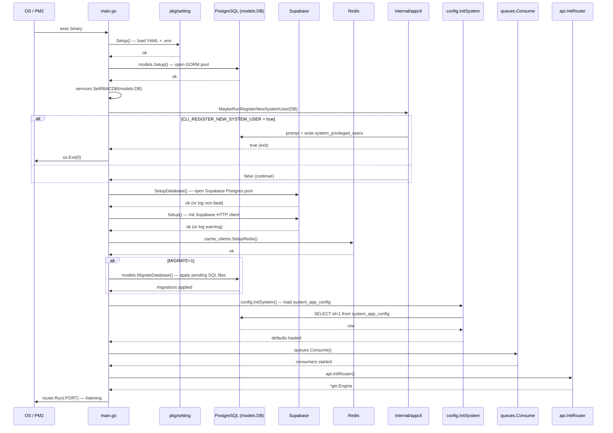
```mermaid
sequenceDiagram
    participant OS as OS / PM2
    participant Main as main.go
    participant Setting as pkg/setting
    participant DB as PostgreSQL (models.DB)
    participant Supa as Supabase
    participant Redis as Redis
    participant CLI as internal/appcli
    participant Config as config.InitSystem
    participant Queue as queues.Consume
    participant Router as api.InitRouter

    OS->>Main: exec binary
    Main->>Setting: Setup() — load YAML + .env
    Setting-->>Main: ok

    Main->>DB: models.Setup() — open GORM pool
    DB-->>Main: ok
    Main->>Main: services.SetRBACDB(models.DB)

    Main->>CLI: MaybeRunRegisterNewSystemUser(DB)
    alt CLI_REGISTER_NEW_SYSTEM_USER = true
        CLI->>DB: prompt + write system_privileged_users
        CLI-->>Main: true (exit)
        Main->>OS: os.Exit(0)
    else
        CLI-->>Main: false (continue)
    end

    Main->>Supa: SetupDatabase() — open Supabase Postgres pool
    Supa-->>Main: ok (or log non-fatal)
    Main->>Supa: Setup() — init Supabase HTTP client
    Supa-->>Main: ok (or log warning)

    Main->>Redis: cache_clients.SetupRedis()
    Redis-->>Main: ok

    alt MIGRATE=1
        Main->>DB: models.MigrateDatabase() — apply pending SQL files
        DB-->>Main: migrations applied
    end

    Main->>Config: config.InitSystem() — load system_app_config
    Config->>DB: SELECT id=1 from system_app_config
    DB-->>Config: row
    Config-->>Main: defaults loaded

    Main->>Queue: queues.Consume()
    Queue-->>Main: consumers started

    Main->>Router: api.InitRouter()
    Router-->>Main: *gin.Engine
    Main->>OS: router.Run(:PORT) — listening
```

---

## 2. User Registration

**Description:** `POST /api/v1/auth/register` — validates input, checks email uniqueness, hashes password, creates user, sends confirmation email.

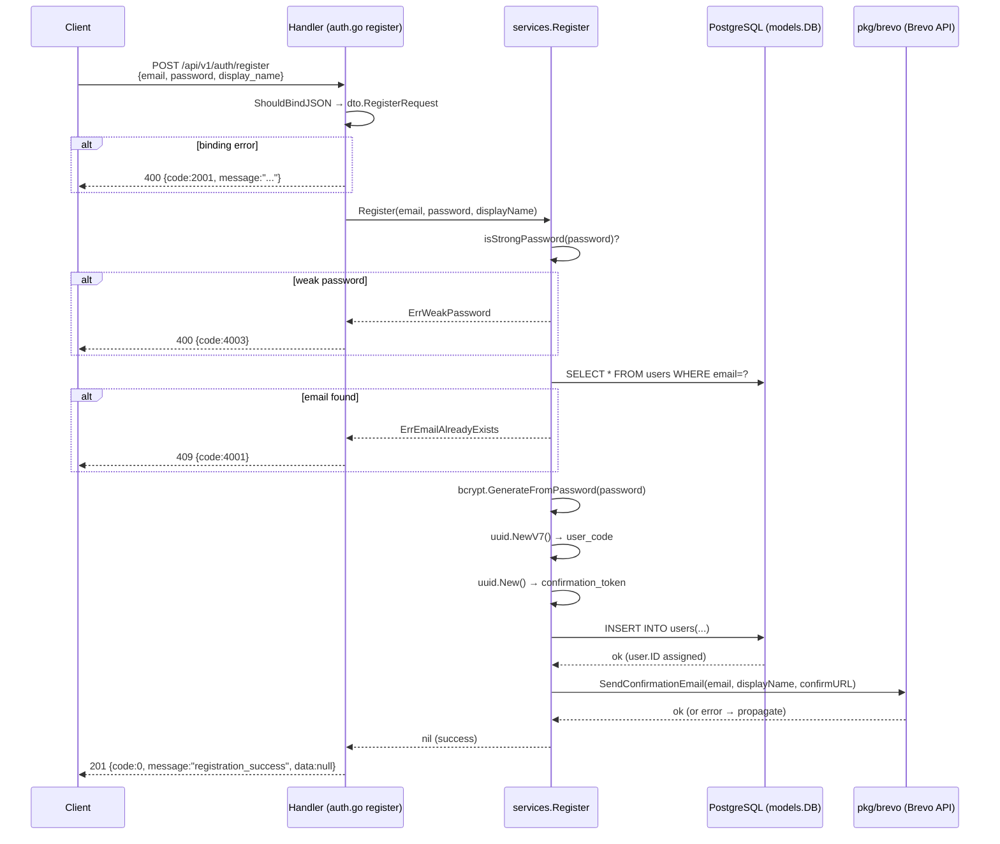
```mermaid
sequenceDiagram
    participant C as Client
    participant H as Handler (auth.go register)
    participant SVC as services.Register
    participant DB as PostgreSQL (models.DB)
    participant Email as pkg/brevo (Brevo API)

    C->>H: POST /api/v1/auth/register<br/>{email, password, display_name}
    H->>H: ShouldBindJSON → dto.RegisterRequest
    alt binding error
        H-->>C: 400 {code:2001, message:"..."}
    end

    H->>SVC: Register(email, password, displayName)
    SVC->>SVC: isStrongPassword(password)?
    alt weak password
        SVC-->>H: ErrWeakPassword
        H-->>C: 400 {code:4003}
    end

    SVC->>DB: SELECT * FROM users WHERE email=?
    alt email found
        SVC-->>H: ErrEmailAlreadyExists
        H-->>C: 409 {code:4001}
    end

    SVC->>SVC: bcrypt.GenerateFromPassword(password)
    SVC->>SVC: uuid.NewV7() → user_code
    SVC->>SVC: uuid.New() → confirmation_token
    SVC->>DB: INSERT INTO users(...)
    DB-->>SVC: ok (user.ID assigned)

    SVC->>Email: SendConfirmationEmail(email, displayName, confirmURL)
    Email-->>SVC: ok (or error → propagate)
    SVC-->>H: nil (success)

    H-->>C: 201 {code:0, message:"registration_success", data:null}
```

---

## 3. Email Confirmation

**Description:** `GET /api/v1/auth/confirm?token=<uuid>` — validates token, confirms email, assigns learner role, issues token pair.

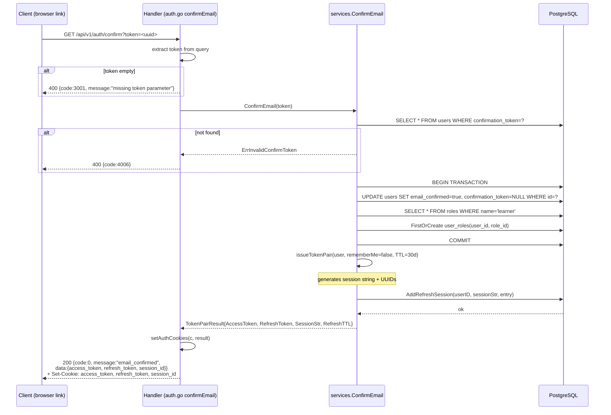
```mermaid
sequenceDiagram
    participant C as Client (browser link)
    participant H as Handler (auth.go confirmEmail)
    participant SVC as services.ConfirmEmail
    participant DB as PostgreSQL

    C->>H: GET /api/v1/auth/confirm?token=<uuid>
    H->>H: extract token from query
    alt token empty
        H-->>C: 400 {code:3001, message:"missing token parameter"}
    end

    H->>SVC: ConfirmEmail(token)
    SVC->>DB: SELECT * FROM users WHERE confirmation_token=?
    alt not found
        SVC-->>H: ErrInvalidConfirmToken
        H-->>C: 400 {code:4006}
    end

    SVC->>DB: BEGIN TRANSACTION
    SVC->>DB: UPDATE users SET email_confirmed=true, confirmation_token=NULL WHERE id=?
    SVC->>DB: SELECT * FROM roles WHERE name='learner'
    SVC->>DB: FirstOrCreate user_roles(user_id, role_id)
    SVC->>DB: COMMIT

    SVC->>SVC: issueTokenPair(user, rememberMe=false, TTL=30d)
    Note over SVC: generates session string + UUIDs
    SVC->>DB: AddRefreshSession(userID, sessionStr, entry)
    DB-->>SVC: ok

    SVC-->>H: TokenPairResult{AccessToken, RefreshToken, SessionStr, RefreshTTL}
    H->>H: setAuthCookies(c, result)
    H-->>C: 200 {code:0, message:"email_confirmed",<br/>data:{access_token, refresh_token, session_id}}<br/>+ Set-Cookie: access_token, refresh_token, session_id
```

---

## 4. User Login

**Description:** `POST /api/v1/auth/login` — validates credentials with Redis negative cache, bcrypt verification, issues token pair with session.

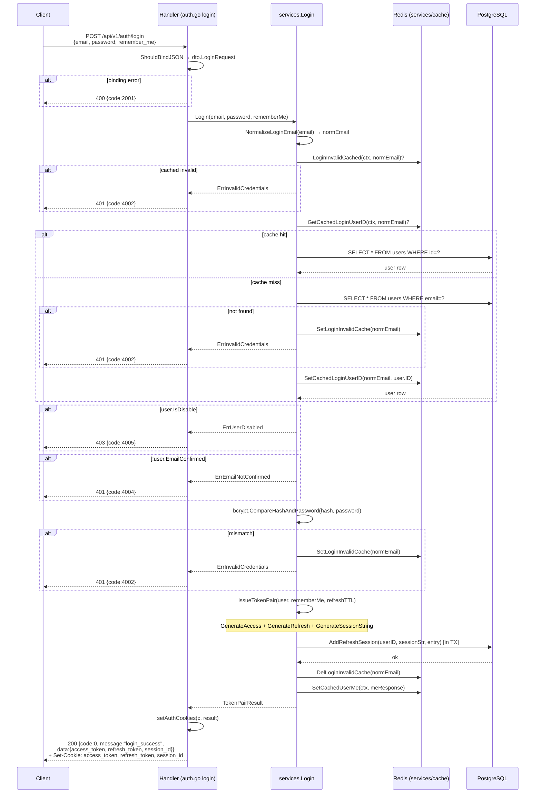
```mermaid
sequenceDiagram
    participant C as Client
    participant H as Handler (auth.go login)
    participant SVC as services.Login
    participant Cache as Redis (services/cache)
    participant DB as PostgreSQL

    C->>H: POST /api/v1/auth/login<br/>{email, password, remember_me}
    H->>H: ShouldBindJSON → dto.LoginRequest
    alt binding error
        H-->>C: 400 {code:2001}
    end

    H->>SVC: Login(email, password, rememberMe)
    SVC->>SVC: NormalizeLoginEmail(email) → normEmail
    SVC->>Cache: LoginInvalidCached(ctx, normEmail)?
    alt cached invalid
        SVC-->>H: ErrInvalidCredentials
        H-->>C: 401 {code:4002}
    end

    SVC->>Cache: GetCachedLoginUserID(ctx, normEmail)?
    alt cache hit
        SVC->>DB: SELECT * FROM users WHERE id=?
        DB-->>SVC: user row
    else cache miss
        SVC->>DB: SELECT * FROM users WHERE email=?
        alt not found
            SVC->>Cache: SetLoginInvalidCache(normEmail)
            SVC-->>H: ErrInvalidCredentials
            H-->>C: 401 {code:4002}
        end
        SVC->>Cache: SetCachedLoginUserID(normEmail, user.ID)
        DB-->>SVC: user row
    end

    alt user.IsDisable
        SVC-->>H: ErrUserDisabled
        H-->>C: 403 {code:4005}
    end
    alt !user.EmailConfirmed
        SVC-->>H: ErrEmailNotConfirmed
        H-->>C: 401 {code:4004}
    end

    SVC->>SVC: bcrypt.CompareHashAndPassword(hash, password)
    alt mismatch
        SVC->>Cache: SetLoginInvalidCache(normEmail)
        SVC-->>H: ErrInvalidCredentials
        H-->>C: 401 {code:4002}
    end

    SVC->>SVC: issueTokenPair(user, rememberMe, refreshTTL)
    Note over SVC: GenerateAccess + GenerateRefresh + GenerateSessionString
    SVC->>DB: AddRefreshSession(userID, sessionStr, entry) [in TX]
    DB-->>SVC: ok

    SVC->>Cache: DelLoginInvalidCache(normEmail)
    SVC->>Cache: SetCachedUserMe(ctx, meResponse)

    SVC-->>H: TokenPairResult
    H->>H: setAuthCookies(c, result)
    H-->>C: 200 {code:0, message:"login_success",<br/>data:{access_token, refresh_token, session_id}}<br/>+ Set-Cookie: access_token, refresh_token, session_id
```

---

## 5. Token Refresh (Session Rotation)

**Description:** `POST /api/v1/auth/refresh` — rotates access + refresh tokens for an existing session using `X-Refresh-Token` + `X-Session-Id` headers.

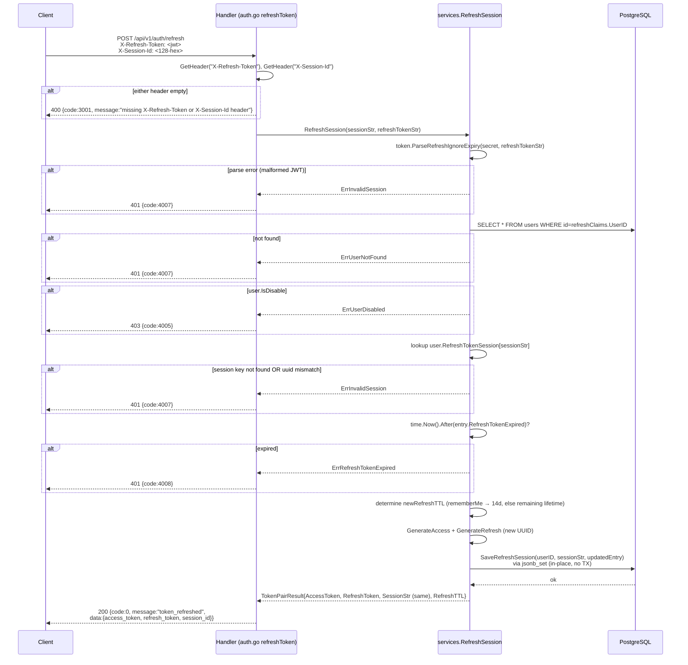
```mermaid
sequenceDiagram
    participant C as Client
    participant H as Handler (auth.go refreshToken)
    participant SVC as services.RefreshSession
    participant DB as PostgreSQL

    C->>H: POST /api/v1/auth/refresh<br/>X-Refresh-Token: <jwt><br/>X-Session-Id: <128-hex>

    H->>H: GetHeader("X-Refresh-Token"), GetHeader("X-Session-Id")
    alt either header empty
        H-->>C: 400 {code:3001, message:"missing X-Refresh-Token or X-Session-Id header"}
    end

    H->>SVC: RefreshSession(sessionStr, refreshTokenStr)
    SVC->>SVC: token.ParseRefreshIgnoreExpiry(secret, refreshTokenStr)
    alt parse error (malformed JWT)
        SVC-->>H: ErrInvalidSession
        H-->>C: 401 {code:4007}
    end

    SVC->>DB: SELECT * FROM users WHERE id=refreshClaims.UserID
    alt not found
        SVC-->>H: ErrUserNotFound
        H-->>C: 401 {code:4007}
    end

    alt user.IsDisable
        SVC-->>H: ErrUserDisabled
        H-->>C: 403 {code:4005}
    end

    SVC->>SVC: lookup user.RefreshTokenSession[sessionStr]
    alt session key not found OR uuid mismatch
        SVC-->>H: ErrInvalidSession
        H-->>C: 401 {code:4007}
    end

    SVC->>SVC: time.Now().After(entry.RefreshTokenExpired)?
    alt expired
        SVC-->>H: ErrRefreshTokenExpired
        H-->>C: 401 {code:4008}
    end

    SVC->>SVC: determine newRefreshTTL (rememberMe → 14d, else remaining lifetime)
    SVC->>SVC: GenerateAccess + GenerateRefresh (new UUID)
    SVC->>DB: SaveRefreshSession(userID, sessionStr, updatedEntry)<br/>via jsonb_set (in-place, no TX)
    DB-->>SVC: ok

    SVC-->>H: TokenPairResult{AccessToken, RefreshToken, SessionStr (same), RefreshTTL}
    H-->>C: 200 {code:0, message:"token_refreshed",<br/>data:{access_token, refresh_token, session_id}}
```

---

## 6. Get My Profile (`GET /me`)

**Description:** Returns authenticated user profile + permissions from Redis cache or Postgres.

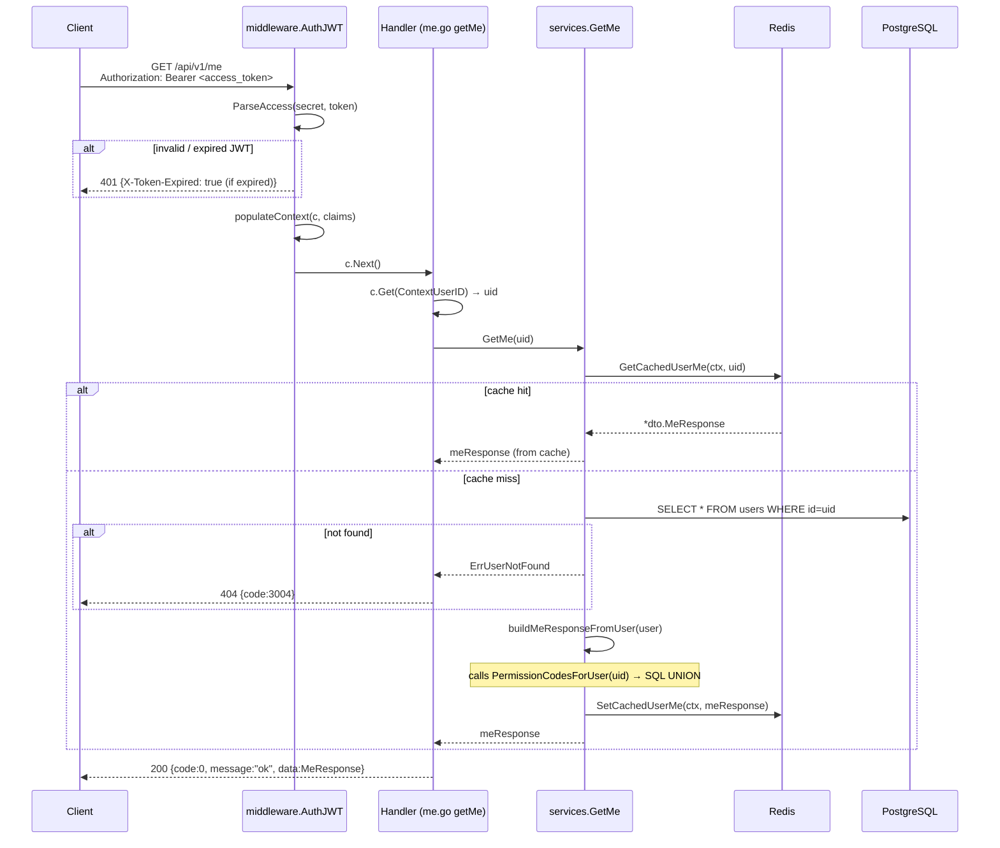
```mermaid
sequenceDiagram
    participant C as Client
    participant MW as middleware.AuthJWT
    participant H as Handler (me.go getMe)
    participant SVC as services.GetMe
    participant Cache as Redis
    participant DB as PostgreSQL

    C->>MW: GET /api/v1/me<br/>Authorization: Bearer <access_token>
    MW->>MW: ParseAccess(secret, token)
    alt invalid / expired JWT
        MW-->>C: 401 {X-Token-Expired: true (if expired)}
    end
    MW->>MW: populateContext(c, claims)
    MW->>H: c.Next()

    H->>H: c.Get(ContextUserID) → uid
    H->>SVC: GetMe(uid)

    SVC->>Cache: GetCachedUserMe(ctx, uid)
    alt cache hit
        Cache-->>SVC: *dto.MeResponse
        SVC-->>H: meResponse (from cache)
    else cache miss
        SVC->>DB: SELECT * FROM users WHERE id=uid
        alt not found
            SVC-->>H: ErrUserNotFound
            H-->>C: 404 {code:3004}
        end
        SVC->>SVC: buildMeResponseFromUser(user)
        Note over SVC: calls PermissionCodesForUser(uid) → SQL UNION
        SVC->>Cache: SetCachedUserMe(ctx, meResponse)
        SVC-->>H: meResponse
    end

    H-->>C: 200 {code:0, message:"ok", data:MeResponse}
```

---

## 7. Get My Permissions (`GET /me/permissions`)

**Description:** Returns the sorted list of permission codes for the authenticated user. Requires `user:read` permission.

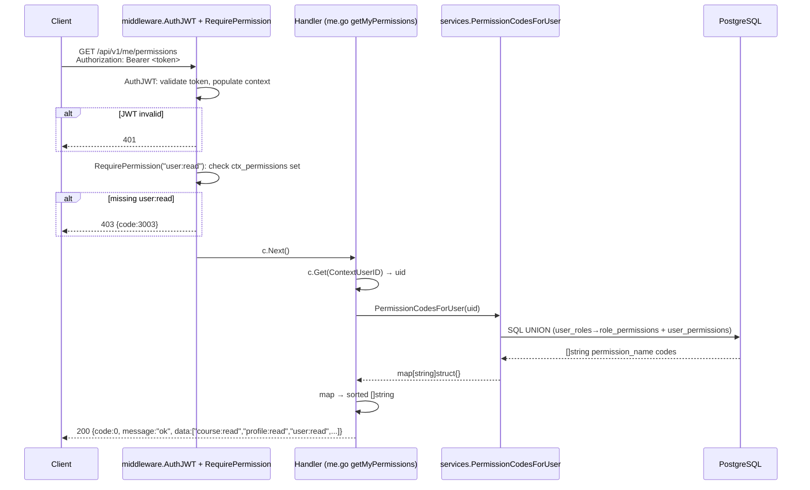
```mermaid
sequenceDiagram
    participant C as Client
    participant MW as middleware.AuthJWT + RequirePermission
    participant H as Handler (me.go getMyPermissions)
    participant SVC as services.PermissionCodesForUser
    participant DB as PostgreSQL

    C->>MW: GET /api/v1/me/permissions<br/>Authorization: Bearer <token>
    MW->>MW: AuthJWT: validate token, populate context
    alt JWT invalid
        MW-->>C: 401
    end
    MW->>MW: RequirePermission("user:read"): check ctx_permissions set
    alt missing user:read
        MW-->>C: 403 {code:3003}
    end
    MW->>H: c.Next()

    H->>H: c.Get(ContextUserID) → uid
    H->>SVC: PermissionCodesForUser(uid)
    SVC->>DB: SQL UNION (user_roles→role_permissions + user_permissions)
    DB-->>SVC: []string permission_name codes
    SVC-->>H: map[string]struct{}

    H->>H: map → sorted []string
    H-->>C: 200 {code:0, message:"ok", data:["course:read","profile:read","user:read",...]}
```

---

## 8. System Login

**Description:** `POST /api/system/login` — HMAC-derived credential check, issues short-lived system JWT.

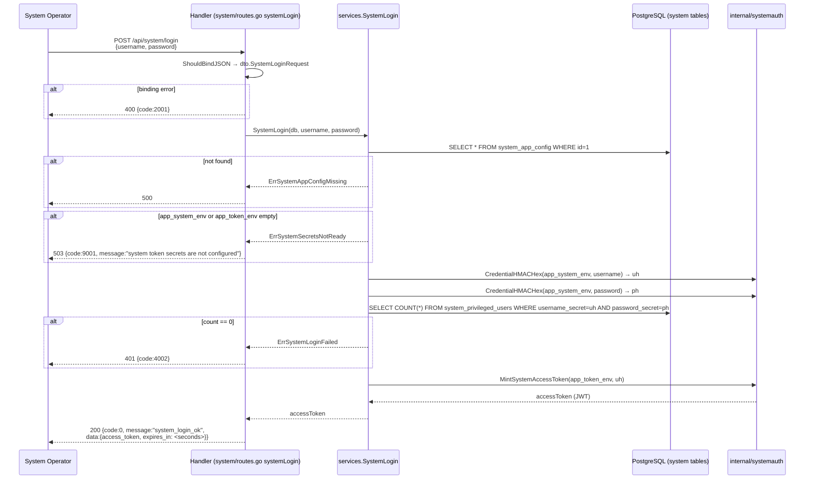
```mermaid
sequenceDiagram
    participant Op as System Operator
    participant H as Handler (system/routes.go systemLogin)
    participant SVC as services.SystemLogin
    participant DB as PostgreSQL (system tables)
    participant Crypto as internal/systemauth

    Op->>H: POST /api/system/login<br/>{username, password}
    H->>H: ShouldBindJSON → dto.SystemLoginRequest
    alt binding error
        H-->>Op: 400 {code:2001}
    end

    H->>SVC: SystemLogin(db, username, password)
    SVC->>DB: SELECT * FROM system_app_config WHERE id=1
    alt not found
        SVC-->>H: ErrSystemAppConfigMissing
        H-->>Op: 500
    end
    alt app_system_env or app_token_env empty
        SVC-->>H: ErrSystemSecretsNotReady
        H-->>Op: 503 {code:9001, message:"system token secrets are not configured"}
    end

    SVC->>Crypto: CredentialHMACHex(app_system_env, username) → uh
    SVC->>Crypto: CredentialHMACHex(app_system_env, password) → ph
    SVC->>DB: SELECT COUNT(*) FROM system_privileged_users WHERE username_secret=uh AND password_secret=ph
    alt count == 0
        SVC-->>H: ErrSystemLoginFailed
        H-->>Op: 401 {code:4002}
    end

    SVC->>Crypto: MintSystemAccessToken(app_token_env, uh)
    Crypto-->>SVC: accessToken (JWT)
    SVC-->>H: accessToken

    H-->>Op: 200 {code:0, message:"system_login_ok",<br/>data:{access_token, expires_in: <seconds>}}
```

---

## 9. Permission Sync (Now)

**Description:** `POST /api/system/permission-sync-now` — upserts all permissions from `constants.AllPermissions` into the DB.

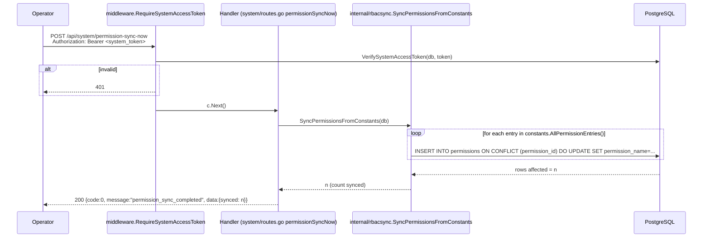
```mermaid
sequenceDiagram
    participant Op as Operator
    participant MW as middleware.RequireSystemAccessToken
    participant H as Handler (system/routes.go permissionSyncNow)
    participant Sync as internal/rbacsync.SyncPermissionsFromConstants
    participant DB as PostgreSQL

    Op->>MW: POST /api/system/permission-sync-now<br/>Authorization: Bearer <system_token>
    MW->>DB: VerifySystemAccessToken(db, token)
    alt invalid
        MW-->>Op: 401
    end
    MW->>H: c.Next()

    H->>Sync: SyncPermissionsFromConstants(db)
    loop for each entry in constants.AllPermissionEntries()
        Sync->>DB: INSERT INTO permissions ON CONFLICT (permission_id) DO UPDATE SET permission_name=...
    end
    DB-->>Sync: rows affected = n
    Sync-->>H: n (count synced)

    H-->>Op: 200 {code:0, message:"permission_sync_completed", data:{synced: n}}
```

---

## 10. Role-Permission Sync (Now)

**Description:** `POST /api/system/role-permission-sync-now` — destroys and rebuilds all `role_permissions` rows from `constants.RolePermissions`.

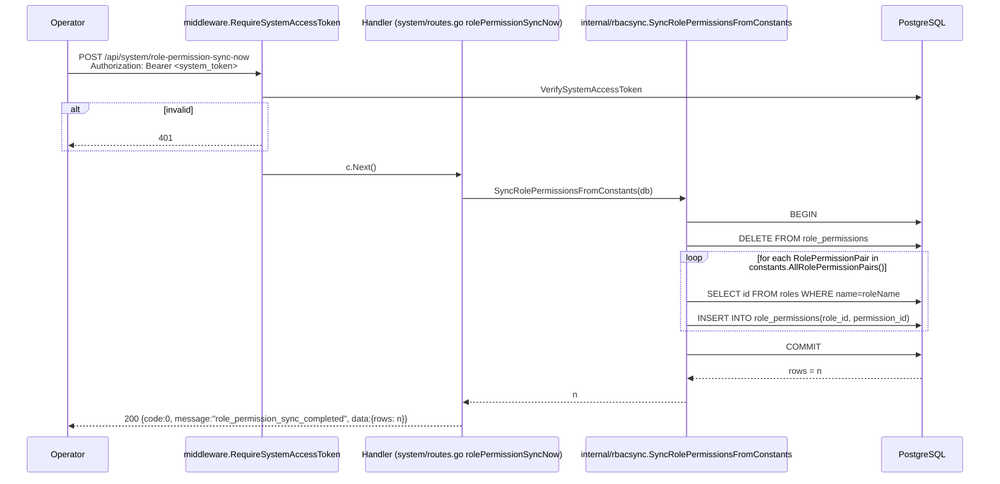
```mermaid
sequenceDiagram
    participant Op as Operator
    participant MW as middleware.RequireSystemAccessToken
    participant H as Handler (system/routes.go rolePermissionSyncNow)
    participant Sync as internal/rbacsync.SyncRolePermissionsFromConstants
    participant DB as PostgreSQL

    Op->>MW: POST /api/system/role-permission-sync-now<br/>Authorization: Bearer <system_token>
    MW->>DB: VerifySystemAccessToken
    alt invalid
        MW-->>Op: 401
    end
    MW->>H: c.Next()

    H->>Sync: SyncRolePermissionsFromConstants(db)
    Sync->>DB: BEGIN
    Sync->>DB: DELETE FROM role_permissions
    loop for each RolePermissionPair in constants.AllRolePermissionPairs()
        Sync->>DB: SELECT id FROM roles WHERE name=roleName
        Sync->>DB: INSERT INTO role_permissions(role_id, permission_id)
    end
    Sync->>DB: COMMIT
    DB-->>Sync: rows = n
    Sync-->>H: n

    H-->>Op: 200 {code:0, message:"role_permission_sync_completed", data:{rows: n}}
```

---

## 11. RBAC — List Permissions (Internal)

**Description:** `GET /api/internal-v1/rbac/permissions` — paginated, filtered permission listing.

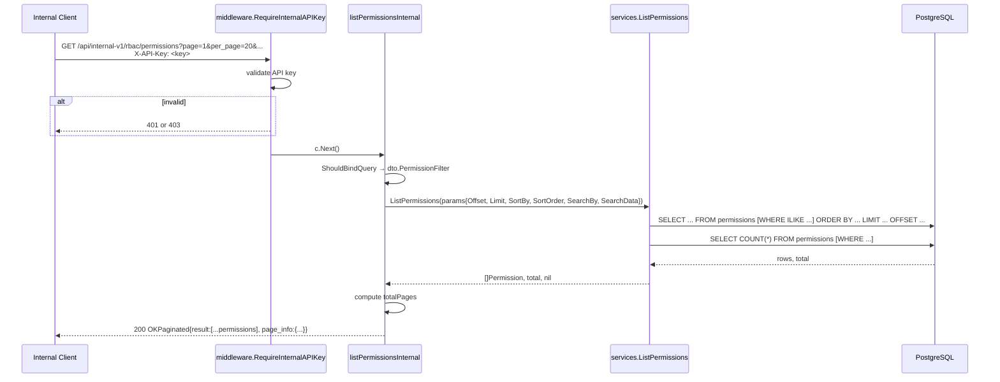
```mermaid
sequenceDiagram
    participant C as Internal Client
    participant MW as middleware.RequireInternalAPIKey
    participant H as listPermissionsInternal
    participant SVC as services.ListPermissions
    participant DB as PostgreSQL

    C->>MW: GET /api/internal-v1/rbac/permissions?page=1&per_page=20&...<br/>X-API-Key: <key>
    MW->>MW: validate API key
    alt invalid
        MW-->>C: 401 or 403
    end
    MW->>H: c.Next()

    H->>H: ShouldBindQuery → dto.PermissionFilter
    H->>SVC: ListPermissions(params{Offset, Limit, SortBy, SortOrder, SearchBy, SearchData})
    SVC->>DB: SELECT ... FROM permissions [WHERE ILIKE ...] ORDER BY ... LIMIT ... OFFSET ...
    SVC->>DB: SELECT COUNT(*) FROM permissions [WHERE ...]
    DB-->>SVC: rows, total
    SVC-->>H: []Permission, total, nil

    H->>H: compute totalPages
    H-->>C: 200 OKPaginated{result:[...permissions], page_info:{...}}
```

---

## 12. RBAC — Create Permission (Internal)

**Description:** `POST /api/internal-v1/rbac/permissions` — creates a new permission row.

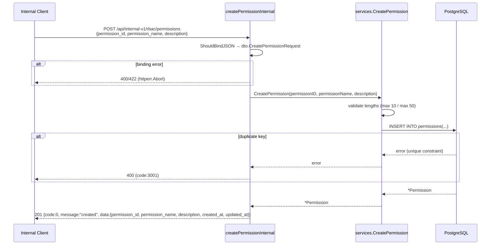
```mermaid
sequenceDiagram
    participant C as Internal Client
    participant H as createPermissionInternal
    participant SVC as services.CreatePermission
    participant DB as PostgreSQL

    C->>H: POST /api/internal-v1/rbac/permissions<br/>{permission_id, permission_name, description}
    H->>H: ShouldBindJSON → dto.CreatePermissionRequest
    alt binding error
        H-->>C: 400/422 (httperr.Abort)
    end

    H->>SVC: CreatePermission(permissionID, permissionName, description)
    SVC->>SVC: validate lengths (max 10 / max 50)
    SVC->>DB: INSERT INTO permissions(...)
    alt duplicate key
        DB-->>SVC: error (unique constraint)
        SVC-->>H: error
        H-->>C: 400 {code:3001}
    end
    DB-->>SVC: *Permission
    SVC-->>H: *Permission

    H-->>C: 201 {code:0, message:"created", data:{permission_id, permission_name, description, created_at, updated_at}}
```

---

## 13. RBAC — Update Permission (Internal)

**Description:** `PATCH /api/internal-v1/rbac/permissions/:permissionId` — updates `permission_id`, `permission_name`, and/or `description`.

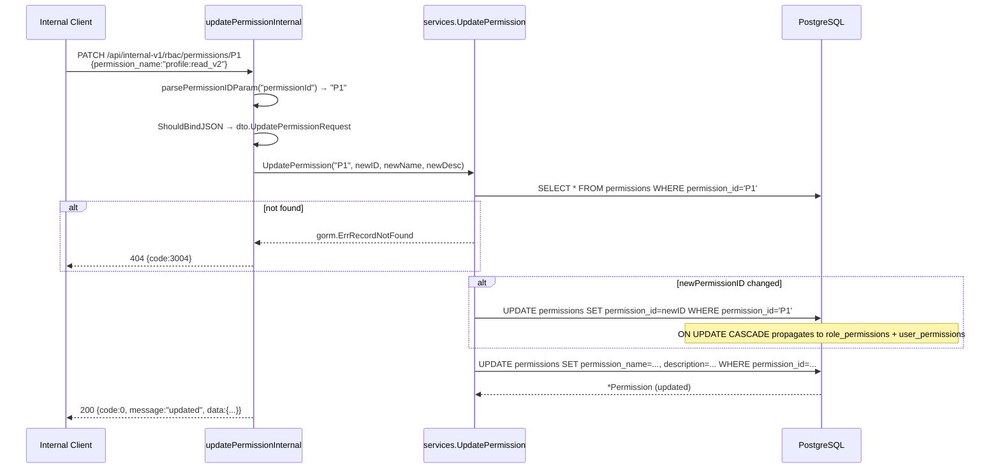
```mermaid
sequenceDiagram
    participant C as Internal Client
    participant H as updatePermissionInternal
    participant SVC as services.UpdatePermission
    participant DB as PostgreSQL

    C->>H: PATCH /api/internal-v1/rbac/permissions/P1<br/>{permission_name:"profile:read_v2"}
    H->>H: parsePermissionIDParam("permissionId") → "P1"
    H->>H: ShouldBindJSON → dto.UpdatePermissionRequest
    H->>SVC: UpdatePermission("P1", newID, newName, newDesc)

    SVC->>DB: SELECT * FROM permissions WHERE permission_id='P1'
    alt not found
        SVC-->>H: gorm.ErrRecordNotFound
        H-->>C: 404 {code:3004}
    end

    alt newPermissionID changed
        SVC->>DB: UPDATE permissions SET permission_id=newID WHERE permission_id='P1'
        Note over DB: ON UPDATE CASCADE propagates to role_permissions + user_permissions
    end
    SVC->>DB: UPDATE permissions SET permission_name=..., description=... WHERE permission_id=...
    DB-->>SVC: *Permission (updated)

    H-->>C: 200 {code:0, message:"updated", data:{...}}
```

---

## 14. RBAC — Delete Permission (Internal)

**Description:** `DELETE /api/internal-v1/rbac/permissions/:permissionId` — cascades deletion to role_permissions and user_permissions, then deletes the permission itself.

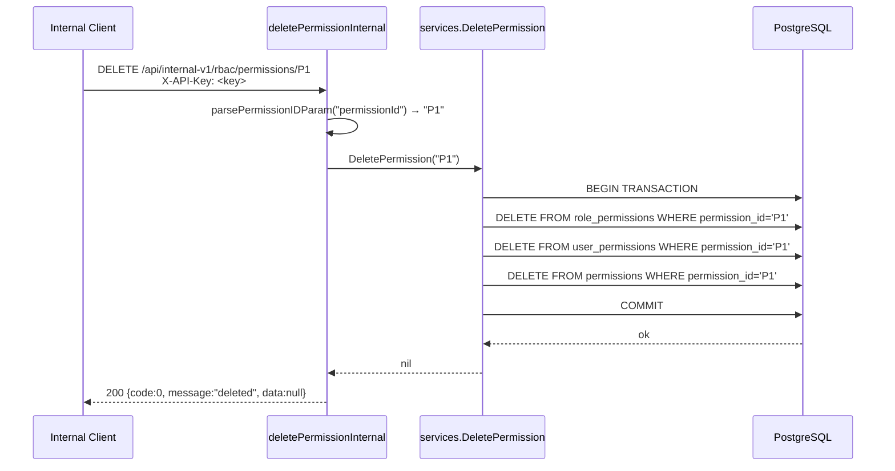
```mermaid
sequenceDiagram
    participant C as Internal Client
    participant H as deletePermissionInternal
    participant SVC as services.DeletePermission
    participant DB as PostgreSQL

    C->>H: DELETE /api/internal-v1/rbac/permissions/P1<br/>X-API-Key: <key>
    H->>H: parsePermissionIDParam("permissionId") → "P1"
    H->>SVC: DeletePermission("P1")

    SVC->>DB: BEGIN TRANSACTION
    SVC->>DB: DELETE FROM role_permissions WHERE permission_id='P1'
    SVC->>DB: DELETE FROM user_permissions WHERE permission_id='P1'
    SVC->>DB: DELETE FROM permissions WHERE permission_id='P1'
    SVC->>DB: COMMIT

    DB-->>SVC: ok
    SVC-->>H: nil

    H-->>C: 200 {code:0, message:"deleted", data:null}
```

---

## 15. RBAC — List / Get Roles (Internal)

**Description:** `GET /api/internal-v1/rbac/roles` and `GET /api/internal-v1/rbac/roles/:id`.

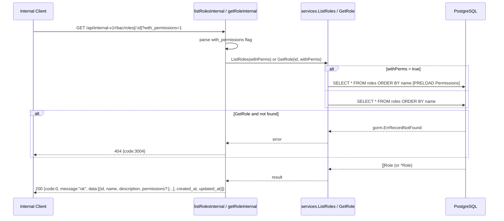
```mermaid
sequenceDiagram
    participant C as Internal Client
    participant H as listRolesInternal / getRoleInternal
    participant SVC as services.ListRoles / GetRole
    participant DB as PostgreSQL

    C->>H: GET /api/internal-v1/rbac/roles[/:id]?with_permissions=1
    H->>H: parse with_permissions flag
    H->>SVC: ListRoles(withPerms) or GetRole(id, withPerms)

    alt withPerms = true
        SVC->>DB: SELECT * FROM roles ORDER BY name [PRELOAD Permissions]
    else
        SVC->>DB: SELECT * FROM roles ORDER BY name
    end

    alt GetRole and not found
        DB-->>SVC: gorm.ErrRecordNotFound
        SVC-->>H: error
        H-->>C: 404 {code:3004}
    end

    DB-->>SVC: []Role (or *Role)
    SVC-->>H: result

    H-->>C: 200 {code:0, message:"ok", data:[{id, name, description, permissions?:[...], created_at, updated_at}]}
```

---

## 16. RBAC — Create / Update / Delete Role (Internal)

**Description:** Role lifecycle operations.

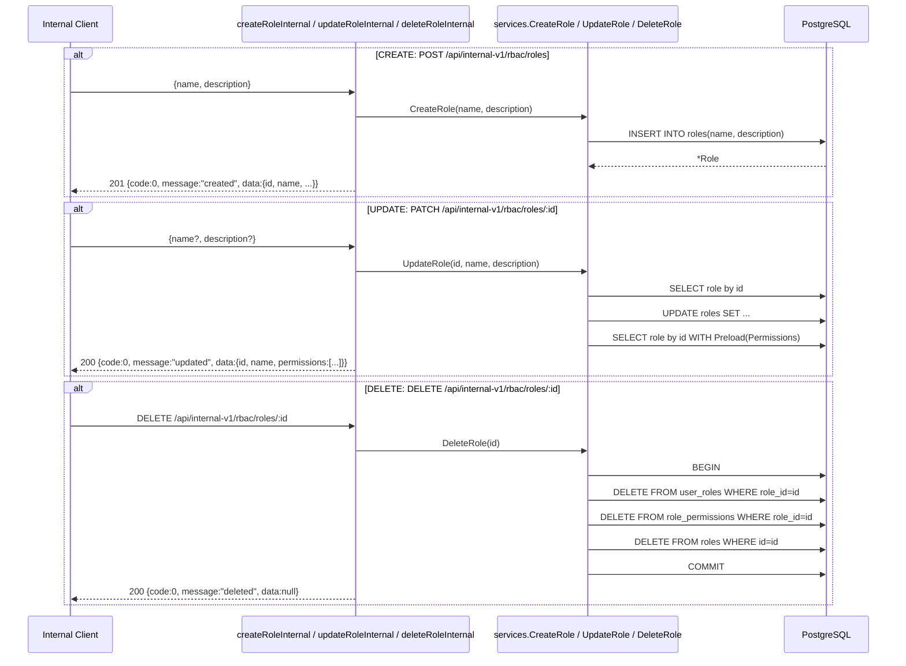
```mermaid
sequenceDiagram
    participant C as Internal Client
    participant H as createRoleInternal / updateRoleInternal / deleteRoleInternal
    participant SVC as services.CreateRole / UpdateRole / DeleteRole
    participant DB as PostgreSQL

    alt CREATE: POST /api/internal-v1/rbac/roles
        C->>H: {name, description}
        H->>SVC: CreateRole(name, description)
        SVC->>DB: INSERT INTO roles(name, description)
        DB-->>SVC: *Role
        H-->>C: 201 {code:0, message:"created", data:{id, name, ...}}
    end

    alt UPDATE: PATCH /api/internal-v1/rbac/roles/:id
        C->>H: {name?, description?}
        H->>SVC: UpdateRole(id, name, description)
        SVC->>DB: SELECT role by id
        SVC->>DB: UPDATE roles SET ...
        SVC->>DB: SELECT role by id WITH Preload(Permissions)
        H-->>C: 200 {code:0, message:"updated", data:{id, name, permissions:[...]}}
    end

    alt DELETE: DELETE /api/internal-v1/rbac/roles/:id
        C->>H: DELETE /api/internal-v1/rbac/roles/:id
        H->>SVC: DeleteRole(id)
        SVC->>DB: BEGIN
        SVC->>DB: DELETE FROM user_roles WHERE role_id=id
        SVC->>DB: DELETE FROM role_permissions WHERE role_id=id
        SVC->>DB: DELETE FROM roles WHERE id=id
        SVC->>DB: COMMIT
        H-->>C: 200 {code:0, message:"deleted", data:null}
    end
```

---

## 17. RBAC — Set Role Permissions (Internal)

**Description:** `PUT /api/internal-v1/rbac/roles/:id/permissions` — full replace of a role's permission set.

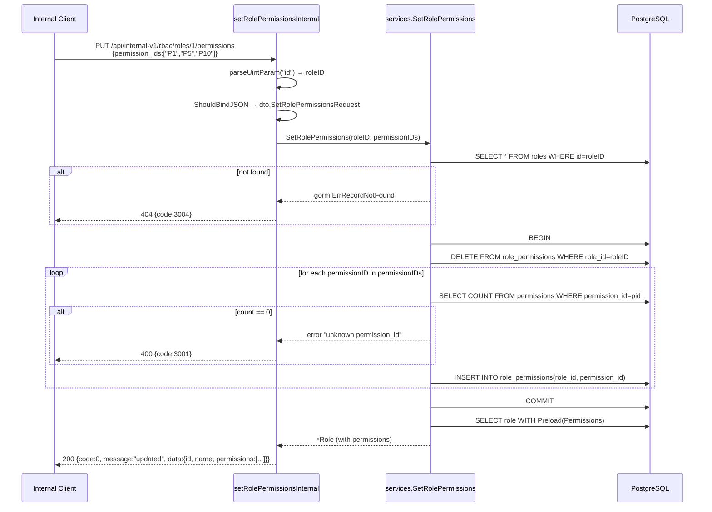
```mermaid
sequenceDiagram
    participant C as Internal Client
    participant H as setRolePermissionsInternal
    participant SVC as services.SetRolePermissions
    participant DB as PostgreSQL

    C->>H: PUT /api/internal-v1/rbac/roles/1/permissions<br/>{permission_ids:["P1","P5","P10"]}
    H->>H: parseUintParam("id") → roleID
    H->>H: ShouldBindJSON → dto.SetRolePermissionsRequest
    H->>SVC: SetRolePermissions(roleID, permissionIDs)

    SVC->>DB: SELECT * FROM roles WHERE id=roleID
    alt not found
        SVC-->>H: gorm.ErrRecordNotFound
        H-->>C: 404 {code:3004}
    end

    SVC->>DB: BEGIN
    SVC->>DB: DELETE FROM role_permissions WHERE role_id=roleID
    loop for each permissionID in permissionIDs
        SVC->>DB: SELECT COUNT FROM permissions WHERE permission_id=pid
        alt count == 0
            SVC-->>H: error "unknown permission_id"
            H-->>C: 400 {code:3001}
        end
        SVC->>DB: INSERT INTO role_permissions(role_id, permission_id)
    end
    SVC->>DB: COMMIT

    SVC->>DB: SELECT role WITH Preload(Permissions)
    SVC-->>H: *Role (with permissions)
    H-->>C: 200 {code:0, message:"updated", data:{id, name, permissions:[...]}}
```

---

## 18. RBAC — Assign User Role (Internal)

**Description:** `POST /api/internal-v1/rbac/users/:userId/roles` — assigns a role to a user (idempotent).

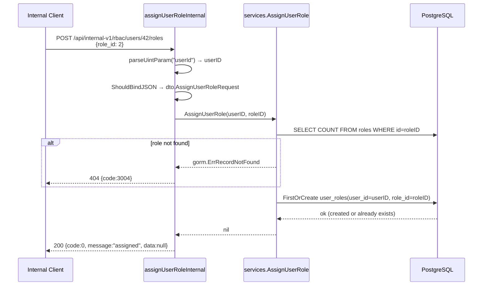
```mermaid
sequenceDiagram
    participant C as Internal Client
    participant H as assignUserRoleInternal
    participant SVC as services.AssignUserRole
    participant DB as PostgreSQL

    C->>H: POST /api/internal-v1/rbac/users/42/roles<br/>{role_id: 2}
    H->>H: parseUintParam("userId") → userID
    H->>H: ShouldBindJSON → dto.AssignUserRoleRequest
    H->>SVC: AssignUserRole(userID, roleID)

    SVC->>DB: SELECT COUNT FROM roles WHERE id=roleID
    alt role not found
        SVC-->>H: gorm.ErrRecordNotFound
        H-->>C: 404 {code:3004}
    end

    SVC->>DB: FirstOrCreate user_roles(user_id=userID, role_id=roleID)
    DB-->>SVC: ok (created or already exists)
    SVC-->>H: nil

    H-->>C: 200 {code:0, message:"assigned", data:null}
```

---

## 19. RBAC — Remove User Role (Internal)

**Description:** `DELETE /api/internal-v1/rbac/users/:userId/roles/:roleId`.

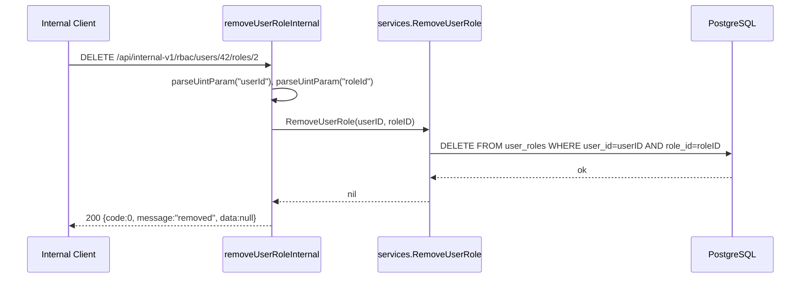
```mermaid
sequenceDiagram
    participant C as Internal Client
    participant H as removeUserRoleInternal
    participant SVC as services.RemoveUserRole
    participant DB as PostgreSQL

    C->>H: DELETE /api/internal-v1/rbac/users/42/roles/2
    H->>H: parseUintParam("userId"), parseUintParam("roleId")
    H->>SVC: RemoveUserRole(userID, roleID)
    SVC->>DB: DELETE FROM user_roles WHERE user_id=userID AND role_id=roleID
    DB-->>SVC: ok
    SVC-->>H: nil
    H-->>C: 200 {code:0, message:"removed", data:null}
```

---

## 20. RBAC — List User Permissions (Internal)

**Description:** `GET /api/internal-v1/rbac/users/:userId/permissions` (effective) and `GET .../direct-permissions`.

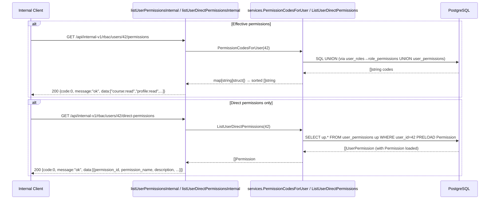
```mermaid
sequenceDiagram
    participant C as Internal Client
    participant H as listUserPermissionsInternal / listUserDirectPermissionsInternal
    participant SVC as services.PermissionCodesForUser / ListUserDirectPermissions
    participant DB as PostgreSQL

    alt Effective permissions
        C->>H: GET /api/internal-v1/rbac/users/42/permissions
        H->>SVC: PermissionCodesForUser(42)
        SVC->>DB: SQL UNION (via user_roles→role_permissions UNION user_permissions)
        DB-->>SVC: []string codes
        SVC-->>H: map[string]struct{} → sorted []string
        H-->>C: 200 {code:0, message:"ok", data:["course:read","profile:read",...]}
    end

    alt Direct permissions only
        C->>H: GET /api/internal-v1/rbac/users/42/direct-permissions
        H->>SVC: ListUserDirectPermissions(42)
        SVC->>DB: SELECT up.* FROM user_permissions up WHERE user_id=42 PRELOAD Permission
        DB-->>SVC: []UserPermission (with Permission loaded)
        SVC-->>H: []Permission
        H-->>C: 200 {code:0, message:"ok", data:[{permission_id, permission_name, description, ...}]}
    end
```

---

## 21. RBAC — Assign / Remove User Direct Permission (Internal)

**Description:** `POST` and `DELETE /api/internal-v1/rbac/users/:userId/direct-permissions[/:permissionId]`.

```mermaid
sequenceDiagram
    participant C as Internal Client
    participant H as assignUserPermissionInternal / removeUserPermissionInternal
    participant SVC as services.AssignUserPermission / RemoveUserPermission
    participant DB as PostgreSQL

    alt ASSIGN by permission_id
        C->>H: POST /api/internal-v1/rbac/users/42/direct-permissions<br/>{permission_id:"P5"}
        H->>SVC: AssignUserPermission(42, "P5")
        SVC->>DB: SELECT COUNT FROM permissions WHERE permission_id='P5'
        alt not found
            SVC-->>H: gorm.ErrRecordNotFound
            H-->>C: 404 {code:3004}
        end
        SVC->>DB: FirstOrCreate user_permissions(user_id=42, permission_id='P5')
        H-->>C: 200 {code:0, message:"assigned", data:null}
    end

    alt ASSIGN by permission_name
        C->>H: POST {permission_name:"course:read"}
        H->>SVC: AssignUserPermissionByPermissionName(42, "course:read")
        SVC->>DB: SELECT * FROM permissions WHERE permission_name='course:read'
        SVC->>SVC: AssignUserPermission(42, p.PermissionID)
        H-->>C: 200 {code:0, message:"assigned", data:null}
    end

    alt REMOVE
        C->>H: DELETE /api/internal-v1/rbac/users/42/direct-permissions/P5
        H->>SVC: RemoveUserPermission(42, "P5")
        SVC->>DB: DELETE FROM user_permissions WHERE user_id=42 AND permission_id='P5'
        H-->>C: 200 {code:0, message:"removed", data:null}
    end
```

---

## 22. JWT Auth Middleware Flow

**Description:** How `middleware.AuthJWT` validates every request to authenticated routes.

```mermaid
sequenceDiagram
    participant C as Client
    participant MW as middleware.AuthJWT (requireJWT)
    participant Token as pkg/token.ParseAccess
    participant H as Next Handler

    C->>MW: Any request to /api/v1/* (authenticated)
    MW->>MW: extractBearerToken(c) — parse "Authorization: Bearer <tok>"
    alt no token
        MW-->>C: 401 {code:3002, message:"missing bearer token"} (AbortFail)
    end

    MW->>Token: ParseAccess(secret, tok)
    alt JWT expired (jwt.ErrTokenExpired)
        MW->>C: Header("X-Token-Expired", "true")
        MW-->>C: 401 {code:3002, message:"token expired"} (AbortFail)
    else JWT invalid / parse error
        MW-->>C: 401 {code:3002, message:"invalid token"} (AbortFail)
    end

    alt claims.UserID == 0
        MW-->>C: 401 {code:3002, message:"token missing user_id"} (AbortFail)
    end

    MW->>MW: populateContext(c, claims)
    Note over MW: sets ctx: user_id, ctx_user_code, ctx_email, ctx_display_name, ctx_permissions
    MW->>H: c.Next()
```

---

## 23. RequirePermission Middleware Flow

**Description:** Per-route or per-group permission guard using JWT claims.

```mermaid
sequenceDiagram
    participant MW as AuthJWT (already ran)
    participant PermMW as middleware.RequirePermission(requiredAction)
    participant H as Next Handler
    participant C as Client

    MW->>PermMW: request (with ctx_permissions map set)

    PermMW->>PermMW: c.Get(ContextPermissions) → permSet map[string]struct{}
    alt permSet missing from context (no auth)
        PermMW-->>C: 403 {code:3003, message:"forbidden"} (AbortFail)
    end

    PermMW->>PermMW: _, ok := permSet[requiredAction]
    alt ok = false (missing permission)
        PermMW-->>C: 403 {code:3003, message:"forbidden"} (AbortFail)
    end

    PermMW->>H: c.Next()
    H-->>C: handler response
```
